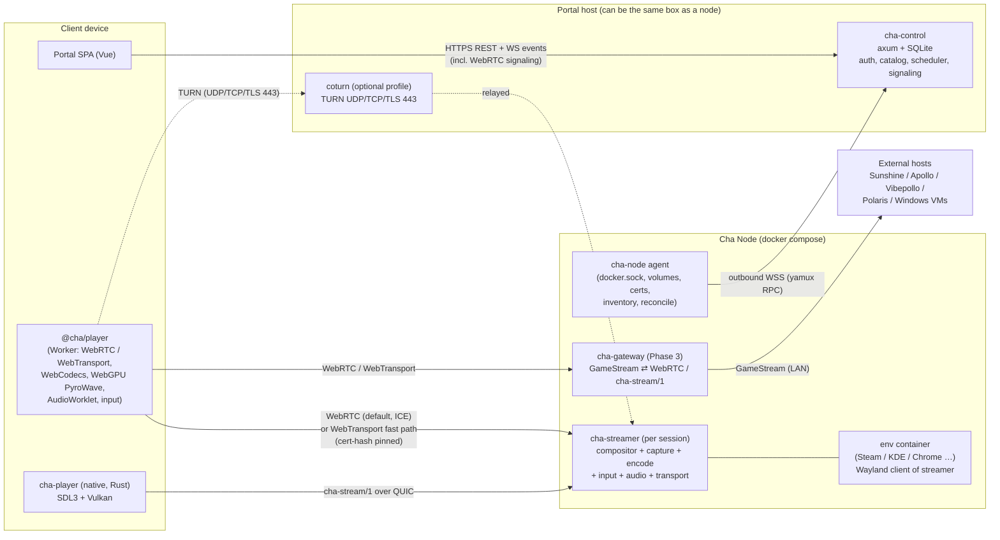

# Cha Portal: architecture and delivery plan

*Draft v0.2, 2026-10-03. Based on the research in [`docs/research/`](research/README.md). v0.2 moves Phase 1 onto our own engine, without Wolf ([ADR 0004](adr/0004-own-engine-no-wolf.md)).*

Cha Portal (portal.cha.sh) is a self-hosted dashboard for "portaling" into remote environments: a Chrome instance, a KDE desktop, Steam Big Picture, or an external Moonlight-protocol host. It aims for Moonlight-class latency in the browser or in a thin native client. Environments run on **Cha Nodes**, docker compose stacks on GPU servers that enroll with the portal and are driven by it.

---

## 0. TL;DR

- **Three tiers.**
  - `cha-control`: the portal API, auth, scheduling and signaling.
  - `cha-node`: an agent on each GPU server that dials *out* to the portal and reconciles containers.
  - `cha-streamer`: a per-session media engine with its own headless compositor, encoders and transport.

  The browser streams **directly from the node**. The portal only signals.
- **Two transports, one session model:**
  - **WebRTC is the universal baseline.** Every commercial cloud gaming service uses it in the browser, it is the only transport that works on Safari/iOS, it is exempt from Chrome's Local Network Access prompt, and ICE/TURN handle NAT. The node stamps `playout-delay` 0/0 so Chrome renders frames as soon as they arrive.
  - **WebTransport is the fast path** for Chromium and Firefox ≥153 when the node is directly reachable. It carries our own `cha-stream/1` framing: media and input on datagrams, control on one stream. This is where high-rate PyroWave lives.
  - The **native client uses raw QUIC** with the same framing. WebSocket is the last resort.
  - `cha-stream/1` is written once as a Sans-IO Rust crate: used by the streamer and the native client, compiled to wasm for the browser.
- **Codec ladder:**
  - **PyroWave** for wired LAN, decoded in the browser by a **WebGPU** port. Nobody ships this yet; it is our wedge.
  - **AV1/HEVC** with adaptive bitrate over WAN.
  - **H.264** for compatibility.
- **Own the engine** ([ADR 0004](adr/0004-own-engine-no-wolf.md)). We write every piece on the hot path, and every piece small enough to own. A library comes in only when rebuilding it would be a project of its own *and* it is already lean. All licenses are compatible with AGPL.
  - **Ours:**
    - the compositor (on Smithay);
    - the NVENC/CUDA binding (no GStreamer or FFmpeg on the node);
    - the audio server;
    - virtual gamepads and their hotplug;
    - the Docker API client;
    - the environment images;
    - `cha-stream/1`;
    - the WebGPU PyroWave decoder.
  - **Borrowed:**
    - Smithay (the Wayland protocol toolkit);
    - str0m (WebRTC) and quinn (QUIC);
    - libopus;
    - libpyrowave (the encoder, pinned);
    - ~~moonlight-common-rust (external Moonlight hosts only)~~ replaced by our own GameStream client in `cha-gamestream` (2026-10-07, [ADR 0011](adr/0011-own-gamestream-client.md)); it stays a test-only dependency for cross-checks;
    - Docker Engine.
  - **Design patterns** from Punktfunk (WebTransport certs, a shared core) and Nestri (QUIC media-transport rules).
- **No Wolf.** Phase 0 already built a working minimal engine (S2), so Phase 1 ships on `cha-streamer` directly. `cha-gateway` only bridges external Moonlight hosts (Sunshine, Apollo, Vibepollo, Polaris), in Phase 3.
- **Stack:**
  - **Rust** for every backend and native component, with one shared protocol crate.
  - **Vue 3 + TypeScript** for the portal.
  - A **framework-agnostic TS player package**: Workers, WebCodecs, WebGPU.
- **Phase 0 is a set of go/no-go spikes**, chiefly: can a browser sustain PyroWave (300–800 Mbit/s over WebTransport datagrams *or* WebRTC unreliable data channels, plus a WebGPU decode) at native-class latency? The answer decides whether the native client or browser PyroWave comes first. Browser PyroWave can only ever reach browsers with WebGPU: Chrome on Windows/macOS/ChromeOS and some Linux GPUs, Safari 26+, and Firefox on Windows/macOS but **not Linux**.

---

## 1. Decisions and assumptions

| Topic | Decision | Source |
|---|---|---|
| Target scale | Homelab / small group first. Design so team scale is possible later. | User |
| License | **AGPL-3.0-or-later**. GPL-3 code (moonlight-common-rust, Sunshine bits) may be embedded. *Since ADR 0011 (2026-10-07) shipped crates carry none: GPL projects are reference-only, so app-store builds stay possible ([ADR 0012](adr/0012-cla-for-app-store-builds.md), [PROVENANCE.md](PROVENANCE.md)).* | User (approved 2026-10-03) |
| Network | LAN and WAN equally first-class → adaptive codec ladder | User |
| Exposure | **Strictly self-hosted.** No `cha.sh`-hosted relays, DNS or cert brokers. For remote access we recommend a tunnel/overlay such as **Tailscale** (also Headscale/NetBird/WireGuard). TURN stays an optional self-hosted add-on. | User (2026-10-03) |
| Baseline client | **MacBook Pro M4 + Google Chrome (macOS), wired 1 GbE, targeting 1440p60.** Every gate and benchmark is measured on this first. 90 and 120 fps are options (per app, and switchable live on desktop apps); the baseline stays 60. | User (2026-10-03) |
| Node test hardware | NVIDIA, AMD and Intel Linux boxes are all available | User (2026-10-03) |
| Priorities | Phase 2: **Chrome environment before KDE**. The Moonlight *host* façade stays in "Later", because `cha-stream/1` is the first-class protocol. | User (2026-10-03) |
| Backend language | **Rust** (control plane, node agent, streamer, gateway, native client) | Recommendation, approved |
| Frontend | **Vue 3 + TS + Vite** | Recommendation, approved |
| Node OS | Linux x86_64, Docker Engine (rootful) with NVIDIA CDI or `/dev/dri` | Assumption |
| Build vs borrow | **Our own implementation of everything**, unless rebuilding it would be too large a project; only the most efficient pieces. No Wolf, no Games-on-Whales images, no GStreamer/FFmpeg in the node's media path. Details in [ADR 0004](adr/0004-own-engine-no-wolf.md). | User (2026-10-03) |
| GPUs | **NVIDIA first** (NVENC through our own binding, CUDA import of the compositor's buffers). AMD and Intel (VA-API or Vulkan Video) come in a later phase. PyroWave needs only Vulkan compute. | User (2026-10-03) |
| Windows/macOS | Not node hosts. Windows machines join as **external endpoints** (Vibepollo/Sunshine in guest or on bare metal). | Assumption |
| Isolation | Plain containers, never `--privileged`, per-template security profiles. MicroVMs later. | Fits homelab scope |

---

## 2. Architecture

### 2.1 Component map



### 2.2 Components

| Component | Responsibility | Key deps (borrowed) |
|---|---|---|
| **`cha-control`** | Users, passkeys/OIDC, RBAC, node registry and enrollment, catalog/templates, environment lifecycle, placement, session brokering (WebRTC SDP relay to the node, WebTransport candidates + cert hashes, media tokens, short-lived TURN credentials), share links, audit log, serving the SPA | axum, sqlx (SQLite → Postgres later), webauthn-rs, openidconnect, utoipa (OpenAPI → TS client). coturn as a sidecar. |
| **`cha-node`** | Enrollment, one outbound WSS channel (yamux + RPC), GPU/encoder/Vulkan inventory, desired-state reconciliation, image pulls, volumes (`dir`/`zfs`/`btrfs`), streamer process lifecycle (the agent supervises; it is never in the media path), WebTransport cert rotation, `cha doctor` preflight | **Own** thin Docker Engine API client over the socket; yamux; ash (Vulkan probe) |
| **`cha-streamer`** | One per running environment. **Our own** headless Wayland compositor (on Smithay), running at 2–4× the encode rate → zero-copy into the encoders (PyroWave / **our own** NVENC binding) → **WebRTC endpoint (ICE-lite) + WebTransport/QUIC endpoint**. Keyboard and mouse go straight into the compositor's seat. Gamepads are **our own** uinput/uhid devices, hotplugged into the env container. Audio comes from **our own** minimal PulseAudio-protocol server → Opus. Multi-viewer producer/consumer. | Smithay (MIT), NVENC + CUDA driver API (loaded at runtime), libpyrowave, **str0m** (WebRTC, sans-IO, TWCC/BWE, playout-delay), quinn, libopus |
| **`cha-gateway`** (Phase 3) | Bridges **external** GameStream hosts (Sunshine/Apollo/Vibepollo/Polaris) to the same WebRTC/WebTransport endpoints. Passes H.264/HEVC/AV1 **and PyroWave** through, no transcoding. Rewrites H.264/HEVC VUI to `max_num_reorder_frames=0` when the host doesn't, so hardware decoders don't buffer. Translates input. Handles pairing. Proven in S3. | `cha-gamestream`'s client (ADR 0011; was moonlight-common-rust), the moonlight-web-stream v3 design (WebRTC passthrough) |
| **`cha-proto`** | Sans-IO protocol core: message schema, datagram framing, fragmentation, FEC, reassembly, jitter/deadline logic, congestion-control feedback, input encoding. Compiled to wasm for the browser. | Leopard-RS-class FEC crate, prost/serde |
| **Portal SPA** | Dashboard, catalog, launch/connect, node admin, session overlay UI | Vue 3, Vue Router, Pinia, TanStack Query, a Tailwind-based component kit |
| **`@cha/player`** | Framework-agnostic TS player: transports, decoders, renderer, audio, input, stats overlay. Runs the hot path in Workers. | `cha-proto` wasm, `@cha/pyrowave-webgpu` |
| **`cha-player`** (native) | Thin client: raw input, VRR/HDR, Vulkan present, HW decode, PyroWave. Launched from the portal via `cha://` deep link plus a one-time ticket. | SDL3, ash, ffmpeg-next (hwaccel), pyrowave |
| **coturn** (optional portal profile) | TURN over UDP/TCP 3478 and **TLS 443** for WebRTC on CGNAT nodes and restrictive client networks, with ephemeral REST-API credentials minted by `cha-control` | coturn (BSD-3) or eturnal |

### 2.3 Launch and connect flow

```mermaid
sequenceDiagram
  participant B as Browser (SPA + player)
  participant C as cha-control
  participant A as cha-node
  participant S as cha-streamer
  participant E as env container

  B->>C: POST /environments {template}
  C->>C: placement (requirements, load, volume locality, client RTT probes)
  C->>A: desired state: env X on node (over WSS RPC)
  A->>A: pull image (digest), prepare volume, allocate GPU + UDP port
  A->>S: start streamer (compositor up, Wayland socket ready)
  A->>E: start env container (Cha contract: WAYLAND_DISPLAY, PULSE_SERVER, render node, /home)
  A-->>C: env Running {addrs: LAN/overlay/public, WT cert hash signed by node key}
  B->>C: POST /environments/X/connect {decode caps, WebGPU caps, display mode}
  C-->>B: {mediaToken (Ed25519, 60 s), TURN creds, WT candidates + certHashes, codec policy}
  par WebRTC baseline (always)
    B->>C: SDP offer (via portal WS)
    C->>A: forward to streamer
    A-->>C: SDP answer (ICE-lite: host/srflx/TCP candidates)
    C-->>B: answer → ICE/DTLS → video track + data channels
  and WebTransport upgrade (Chromium / Firefox ≥153, if reachable)
    B->>S: WebTransport race to candidates (serverCertificateHashes)
  end
  B->>S: Hello {token, caps, measured bw} on the first transport up
  S-->>B: Config {transport, codec, mode, tier}; media flows
  Note over B,S: if WT connects and the probe passes, hot-switch to it (IDR or fresh PyroWave frame)
  B-->>S: input / control msgs / receiver reports
```

**Environments outlive connections.** Disconnecting leaves the environment running until its idle timeout. Reconnecting gets a fresh keyframe.

---

## 3. Streaming design

### 3.1 `cha-stream/1` protocol and transport mapping

One logical session with the same messages on every transport. Only the carrier changes:

| Logical channel | WebRTC (baseline, all browsers) | WebTransport (fast path) / native QUIC | WebSocket (last resort) |
|---|---|---|---|
| **Control**: Hello/Config, mode changes (resize/refresh/scale), codec/tier switch, keyframe/RFI requests, clipboard, cursor shape, IME text commit, rumble/LED/haptics, stats summaries | Reliable ordered DataChannel `control` | 1 bidi stream | Same framing, multiplexed |
| **Video, H.264/HEVC/AV1** | **RTP video track** (str0m packetization), `playout-delay` 0/0, `abs-capture-time`, NACK, adaptive FlexFEC/RED, TWCC → node-side GCC. Browser decodes natively. | Datagrams with `cha-stream/1` framing `{ver, stream_id, frame_id u32, frag_idx, frag_cnt, fec_meta, flags(key/critical/last), send_ts_us}` + Leopard-RS FEC. Decoded with WebCodecs. | Frames on TCP with frame-ACK backpressure |
| **Video, PyroWave** | Unreliable, unordered DataChannel `media` with `cha-stream/1` framing → WebGPU. Throughput unproven; S1 decides. | Datagrams, critical packets duplicated or FEC'd → WebGPU (browser) or Vulkan/Metal (native) | Not offered |
| **Audio** | RTP Opus track | Datagrams: Opus 48 kHz, 5–10 ms frames with RED | Framed |
| **Input**: mouse rel/abs, gamepad *state snapshots* (loss-tolerant, sequence-numbered, coalesced) | Unreliable/unordered DataChannel `input` (GeForce NOW-style partial reliability for pads) | Datagrams | Framed |
| **Input**: key/button edges, text | Reliable DataChannel `control` | Control stream | Framed |
| **Feedback**: per-frame receive reports (first/last fragment arrival, fragments received, decode-done, presented-at), clock-sync pings | RTCP/TWCC + `getStats()`/`requestVideoFrameCallback` summaries on `control` | Datagrams, batched about every frame | Framed |

*Status (2026-10-08): the WebSocket column is built for share links over the internet ([ADR 0022](adr/0022-share-links-over-a-cloudflare-tunnel.md), [contract](plans/wan-sharing.md)). The streamer serves `GET /ws/media` on its loopback HTTP port: JSON control lines as text messages, `cha-stream/1` datagrams (no FEC, fragments of at most 64 KiB) as binary ones, H.264/HEVC/AV1 only, rate control from its own send queue. The portal and the node each pass the messages through untouched (`/api/media/<ticket>` in, `/api/node/relay/<id>` out), and `@cha/player` decodes them on its WebTransport path. It is the last resort in the player's transport list, not an owner default; the tunnel and the relay are covered by `crates/cha-control/tests/wan.rs`, a run through Cloudflare itself is still to do.*

The WebTransport and native QUIC paths share one `wtransport`/quinn endpoint in the streamer. The WebRTC path is a str0m endpoint (ICE-lite) on the same node. Keyframes on the QUIC path go either on short-lived uni streams or on datagrams with FEC; the Phase 0 spike decides, watching for datagram-before-stream starvation (Nestri).

Rules carried in from the research (Nestri `media-transport.md`, Punktfunk, Vibepollo):

1. **Receiver truth wins.** Congestion control is driven by receiver reports and **send-queue duration** (`backlog_ms`), not by loss. Loss is a lagging signal.
2. **No silent eviction.** Wrap `send_datagram` so drops are counted. Backpressure goes *before the encoder* (skip or capture fewer frames). We never drop an encoded reference frame.
3. **No app-level pacing on QUIC.** QUIC already paces, so we produce less instead.
4. **ResyncGate.** Never send frames that depend on a reference the receiver lacks. On loss: RFI/LTR if the encoder supports it, else intra-refresh, else IDR, bounded in time.
5. **Newest-frame-wins.** If a frame is still queued when the next one is ready, replace it.
6. **Unequal protection.** PyroWave gets FEC (or duplication) on *critical* packets (coarsest band) only, decodes partial frames at the deadline, and needs no keyframes. H.26x/AV1 get per-frame adaptive Leopard-RS FEC (GF(2^16), no ~1 Gbps ceiling).
7. **Protocol versioning from day one.** Explicit wire version, codec bitstream IDs (PyroWave pinned by commit until it has a version field), and capability negotiation in Hello.
8. **1-in-1-out decode.** Low-delay encoder config: no B-frames, VBV of about 1 frame, slices or intra-refresh. Write H.264/HEVC VUI `bitstream_restriction` with `max_num_reorder_frames=0`, as Sunshine's `cbs.cpp` does. Without it, browser hardware decoders hold about 4 frames.
9. **A media-aware QUIC congestion controller.** S1 showed quinn's BBR adds 50–130 ms p99 stalls. Its BDP-sized cwnd is smaller than one frame on a LAN, and it enters ProbeRTT every 10 s. Cubic is only fine because its cwnd grows unbounded on a loss-free LAN. `cha-streamer` gets its own quinn `Controller`:
   - cwnd floor of at least 1–2 frames;
   - no probe phases;
   - rate set from receiver reports and send-queue duration (rule 1).
10. **Measure the WebRTC path too.** The per-frame header (frame-id, capture µs, encode µs) rides in an encoded-transform trailer on RTP, or in the packet header on WebTransport/WebSocket. Chrome's low-latency renderer assumes 60 fps internally, so validate at 120/144 Hz.

### 3.2 Codec ladder and tier selection

| Tier | When | Codec | Typical rate | Notes |
|---|---|---|---|---|
| **L (LAN wired)** | Probe ≥ ~400 Mbit/s, RTT < 3 ms, and either the native client, or a browser with WebGPU (subgroups or the fallback path) plus a transport that sustains the rate (WebTransport, or a DataChannel if S1 shows it can) | **PyroWave** 4:4:4 (desktop) / 4:2:0 (games) | 200–900 Mbit/s (1080p60 → 4K60; ×2 at 120 fps) | Encode is ~0.2–0.3 ms of GPU work at 1440p on an RTX 4090 (S1e); browser decode is 2–6 ms on an M4 Pro (S1b/S1c). Skip unchanged frames (damage) and send periodic heal frames. 1 GbE tops out around 1440p60 4:4:4. **Wire time dominates on 1 GbE**: a 590 Mbit/s 1440p60 frame takes ~10.5 ms to serialize (4:2:0 at 290 Mbit/s: ~5 ms), so expose a quality ↔ latency byte cap. |
| **M (fast LAN / Wi-Fi / fat WAN)** | 40–300 Mbit/s | **HEVC/AV1 10-bit**, 4:4:4 where encoder *and* decoder support it | 40–150 Mbit/s | Intra-refresh, LTR/RFI, slices |
| **W (WAN)** | Everything else | **AV1 → HEVC → H.264** by client decode caps. **Prefer HEVC on Safari**: AV1 decode needs M3/A17 Pro or newer there. | 5–50 Mbit/s adaptive | Delay-based ABR (GCC on WebRTC, queue-based on QUIC), FEC, RFI |
| **Compat** | Old/odd clients | H.264 | — | Always available |

- **S1c result (baseline LAN, 2026-10-03).** Time from send to on-screen, p50 (encode not included): H.264 6.9 ms, AV1 8.0, HEVC 8.0–8.7, PyroWave 4:2:0 11.4, PyroWave 4:4:4 20.0. On 1 GbE + M4 Pro, hardware codecs are the default tier.
- **S1e result (RTX 4090, 2026-10-03).** Encode p50 at 1440p60: NVENC H.264/HEVC/AV1 1.7–2.2 ms; PyroWave 0.21 ms (4:2:0) and 0.33 ms (4:4:4) of GPU work, 1.0 and 1.9 ms wall clock through the WebGPU port. With encode added, the hardware codecs reach the screen ~2.5–3.5 ms before PyroWave 4:2:0 on the baseline (H.264 ~8.9 ms, HEVC ~9.8, PyroWave ~12.4). S1c's predicted tie doesn't happen. S1d then found a faster present path for hardware codecs, track generator → `<video>`, which saves another 4–5 ms against the WebGPU draw S1c used: ~5 ms (hardware) vs ~12.4 ms (PyroWave 4:2:0) from encode to compositor. PyroWave pulls ahead only on fast links (~10 GbE, by ~1–2 ms) or when decode is cheap (desktop GPUs). See `spikes/s1c-codec-compare/README.md` and `spikes/s1e-encode-latency/README.md`.
- **S7 result (WAN, 2026-10-04).** Rate control from the page's reports and FEC sized to the loss on a calm path hold 60 fps over a shaped WAN (netem: 25 Mbit/s, 30 ± 5 ms, 0.5 % loss) at ~86 % of the link, with no gap over 51 ms once parity is up (AV1 and HEVC). At 3 % random loss, nothing is lost. A drop to a sixth of the rate costs one gap of ~250 ms. Lessons: QUIC's loss count and an early FEC rebuild both look like loss under reordering, so the page counts what never arrived; parity for congestion loss feeds the congestion; and NVENC's low-latency CBR makes about two thirds of its target. See `spikes/s7-wan/README.md`.
- **S8 result (RFI in the browser, 2026-10-04).** After NVENC reference frame invalidation, the browser's WebCodecs decoders carry on bit-exactly from the recovery frame: H.264, HEVC and AV1, in hardware and software (Chromium offers no software HEVC). The control, skipping frames nothing was invalidated for, gives 14–18 dB with no error on H.264 and AV1 and a decode error on hardware HEVC, so the match is not luck. A recovery frame costs what any P-frame does; a keyframe costs 2–3 times as much. Lessons: H.264 and AV1 decoders show a missing reference as garbage with no error, so the page may feed nothing past a loss but a keyframe or a recovery frame; and a recovery frame needs a keyframe's parity, or at the onset of loss it is lost with the rest and the page falls back to a keyframe 250 ms later. Live on the S7 bench (HEVC), the gap at a 1 % loss onset halves (234 → ~120 ms); a drop's overflow still costs a keyframe. Intra-refresh isn't pursued: it feeds frames past a loss, which these decoders show as garbage until it heals. See `spikes/s8-rfi/README.md`.
- **S6 result (picture quality, 2026-10-04).** On a Chrome-rendered docs page at 1440p60, against the source: H.264 and HEVC at our settings average 42–43 dB luma and 36–38 dB chroma, and their keyframe comes out at ~30 dB (a one-frame VBV starves it). PyroWave 4:2:0 has the same chroma (subsampling decides it) and 3.5–7 dB more luma in motion. PyroWave 4:4:4 averages 49–60 dB luma and 46–56 dB chroma with no frame under 48 dB: near-lossless text. Verdict: 4:4:4 is the PyroWave mode worth offering, as an opt-in "LAN quality" mode for text-heavy desktops; 4:2:0 only pays on fast links. See `spikes/s6-quality/README.md`.
- **Measure, don't assume (S1b).** A client's PyroWave decode cost depends on its GPU *and its clock behaviour*. An M4 Pro takes ~6 ms per 1440p frame at a 60 fps duty cycle against ~1.3 ms warm. The client therefore runs a short decode probe at the target cadence, alongside the bandwidth probe, and Tier L is only chosen when PyroWave's wire time plus decode beats the hardware codec path measured the same way.
- **Negotiation.**
  - The client probes `VideoDecoder.isConfigSupported()` and `RTCRtpReceiver.getCapabilities()` / MediaCapabilities for each codec with HW acceleration.
  - It checks WebGPU (and subgroups) and runs a short bandwidth probe (Vibepollo-style, a few MiB).
  - The streamer picks the transport and tier, and can **switch live** (new keyframe, or a fresh PyroWave frame) when conditions change.
- **Real-world decode coverage** (2026 dataset in research 05):
  - AV1 is about 91% on Chrome/Firefox but only about 30% on Safari.
  - HEVC is near-universal on Safari but almost nil on Firefox.
  - Neither Chrome nor Firefox decodes HEVC on Linux.
- **Text clarity.** Desktop templates prefer PyroWave 4:4:4 on LAN. On WAN they prefer AV1/HEVC 4:4:4 if the client can decode it. Otherwise they render the cursor client-side and accept 4:2:0.

### 3.3 PyroWave, first-class

1. **Node encode.** Link libpyrowave (C API, commit-pinned) or `nespyro`.
   - Share the compositor's Vulkan device and import the DMA-BUF with modifiers. Run one scaled encode that does RGB→YCbCr, crop and scale, and HDR10.
   - Use a realtime compute queue (`CAP_SYS_NICE` on the streamer only).
   - It uses **no NVENC session**, which matters for many sessions on one GeForce.
   - Set the per-frame byte cap from the congestion controller.
2. **Wire.** Fragment PyroWave packets into WebTransport/QUIC datagrams, or into unreliable WebRTC DataChannel messages; blocks can be about 16 KB, so fragmenting is mandatory. Duplicate or RS-protect critical packets. The receiver assembles until a deadline, then decodes what it has (local blur on loss).
3. **Browser decode.** `@cha/pyrowave-webgpu` is a fork of `imbcmdth/pyrowave@webgpu` (MIT).
   - Decode **directly into a GPUTexture** that the renderer samples. No CPU readback, unlike the upstream port.
   - Add a **subgroup-free dequant path** (workgroup-memory scans), because subgroups are Chrome-only.
   - Validate bit-exactness against the Vulkan build in CI.
   - **Reach**: Chrome on Windows/macOS/ChromeOS, plus Chrome on Linux with Intel Gen12+ or NVIDIA on Wayland (AMD needs a flag); Safari 26+ (over the DataChannel path, because WebKit's WebTransport is broken); Firefox on Windows and Apple Silicon. **Firefox on Linux has no WebGPU**, so those users get Tier M/W or the native client.
4. **Native decode.** libpyrowave on Vulkan (Linux/Windows/Android) and its Metal port (macOS/iOS).
5. **Interop.** `cha-gateway` implements **Vibepollo's PyroWave-over-GameStream contract** (capability bits, `bitStreamFormat=3`, record framing, critical-band FEC). A Vibepollo or Polaris host on the LAN can then be played in the **browser** with PyroWave, which nobody offers today.
6. **Upstream relations.** Ask Themaister for a bitstream version field. Coordinate capability-bit registration with Nonary and LizardByte.

### 3.3a JPEG XS: a CPU LAN tier (planned)

What PyroWave is to GPU nodes, JPEG XS (ISO/IEC 21122) could be to CPU-only nodes (docs/devices.md): a wavelet codec built for latency over fast networks rather than for bitrate. Every frame is coded on its own, line by line, so latency is a fraction of a frame and a lost packet costs a slice of one frame, never later frames. It is visually lossless at about 4–10:1, roughly 200–500 Mbit/s at 1440p60: a fit for 1 GbE, and much lighter on the CPU than any motion-compensated codec.

- **Why.** CPU nodes have only x264 and SVT-AV1 (which spends its cycles on motion search to save bitrate a LAN doesn't need). A JPEG XS tier would give them PyroWave's trade on a LAN: sharp text, the lowest latency, loss-tolerant, at the cost of bandwidth.
- **Encoder.** Intel's SVT-JPEG-XS (BSD-2-Clause-Patent), loaded at run time like x264, behind the streamer's encoder trait. Input from the CPU readback path (planar YUV 4:2:0, and 4:4:4 for desktops); slice-based output, a frame's byte budget from rate control, no references (so no RFI and no keyframe requests).
- **Wire.** Like PyroWave's: slices fragmented into WebTransport datagrams with `cha-proto` framing and FEC sized to loss; the page decodes what arrived by a deadline and repeats the previous frame's missing slices.
- **Browser decode.** No browser decodes JPEG XS. Its entropy coding is simple (no arithmetic coding), and the inverse wavelet is the shape PyroWave's WebGPU decoder already runs, so the decoder would be ours: WebGPU compute, unpacking and dequantisation then the inverse 5/3 wavelet and colour conversion straight into a GPUTexture, with a WebAssembly SIMD fallback where WebGPU is missing. Validated bit-exact against SVT-JPEG-XS's decoder in CI.
- **Licensing first.** JPEG XS carries declared essential patents (ISO's patent database; a licensing pool exists). Before any code: confirm what an AGPL, self-hosted, non-commercial-by-default project owes, and whether SVT-JPEG-XS's patent grant covers our use. If it doesn't fit, the tier doesn't happen; the alternative is PyroWave's CPU port.
- **Spike S9, before committing to it** (on gpu-node.lan's CPU path and the baseline M4 in Chrome):
  1. Encode cost on the node's CPU at 1080p60 and 1440p60, 4:2:0 and 4:4:4, single- and multi-threaded, against x264 and SVT-AV1 on the same frames.
  2. A minimal WebGPU decoder prototype: decode time per 1440p frame on the M4 at a 60 fps duty cycle (as S1b did for PyroWave).
  3. Bitrate against picture quality (PSNR/SSIM on S6's docs page) at the rates 1 GbE can carry, against PyroWave 4:2:0/4:4:4.
  4. Send → shown latency end to end against CPU H.264.

  Gate: it beats CPU H.264 on latency and text sharpness at a CPU cost a 4–8 core node can carry for one 1440p60 stream, and the browser decodes it in under ~4 ms per frame.
- **If it passes:** a codec in `@cha/player` (`jpegxs420`/`jpegxs444`, WebTransport only), offered by CPU devices whose image has the library, chosen by tier selection on LAN like PyroWave (§3.2).

### 3.4 Multi-viewer and sharing

- **Producer/consumer.** There is one compositor/capture producer per environment. Each viewer gets its own encoder instance, so viewers can differ in codec, tier and resolution. Viewers with identical parameters share one encoder.
- **Roles:**
  - `owner`
  - `controller` (keyboard/mouse; one at a time, Neko-style request/give/take)
  - `player-N` (gamepad slot N)
  - `viewer` (no input)

  Roles are carried in the media token. Share links are signed and expiring, Selkies-secure-mode style.

*Status (2026-10-08): share links exist for players, viewers and controllers (ADRs 0014, 0015), and since [ADR 0022](adr/0022-share-links-over-a-cloudflare-tunnel.md) a link can be made **over the internet**: the portal runs `cloudflared` (a quick tunnel, or the owner's named one) while such a link is live, and the tunnel reaches a guest-only listener (`CHA_GUEST_LISTEN`) that knows internet links and nothing else. Guests also get ICE servers (`GET /api/shares/{token}/ice`). Built in `crates/cha-control` and tested against a fake `cloudflared`; the operator side is in `deploy/README.md` ("Links over the internet").*

### 3.5 Input, audio, cursor, clipboard

- **Keyboard and mouse** go straight into the streamer's compositor as Wayland seat events, or via gamescope's EIS socket for games. No uinput is needed.
  - Relative mode (pointer lock, raw) suits games; absolute mode suits desktops.
  - Keys are sent by `KeyboardEvent.code` with a layout hint, and IME text is committed separately.
- **Gamepads.** In the browser, Gamepad API state snapshots; optionally WebHID for DualSense gyro, touchpad and adaptive triggers. On the node, the streamer creates **its own virtual pads**: uinput for Xbox-style pads, uhid for DualSense (so games get its HID reports). It **hotplugs them into the env container**: it creates the device nodes in the container's private `/dev/input`, writes their udev database entries in the container's private `/run/udev`, and sends the udev "add" event on netlink inside the container's network namespace, where libudev (SDL, Steam) listens. Host udev rules (installed by `cha doctor`) keep the virtual pads away from the host seat.
- **Cursor.** In desktop mode the cursor is rendered client-side from cursor-shape and position messages, so it feels local. In game mode it is composited into the video.
- **Audio.** The streamer runs **its own minimal PulseAudio-protocol server** on a socket in the environment's runtime dir (`PULSE_SERVER`). Apps (Chrome, Firefox, SDL, Steam) play into it, and the samples go straight to Opus. There is no sound daemon in the environment and no extra buffering. Environments that need PipeWire itself (KDE) run it with its Pulse sink pointed at ours.
  - On WebRTC it is a native RTP audio track.
  - On QUIC it goes as datagrams with RED, played client side via `AudioDecoder` + an `AudioWorklet` ring buffer (about 20–40 ms target).
  - Mic uplink comes later via a virtual source.
- **Clipboard.** Text in both directions over the control stream using the Async Clipboard API, gated per template. Files come later.

### 3.6 Latency targets and measurement

| Path | Target glass-to-glass (p50) |
|---|---|
| Native client, wired LAN, PyroWave, 120 Hz | ≤ 12 ms |
| Browser (Chrome), wired LAN, PyroWave, 120 Hz | ≤ 20 ms (the browser compositor adds about one frame) |
| **Baseline**: Chrome on M4 MacBook Pro, 1 GbE, PyroWave 1440p60 4:4:4 | ≤ 25 ms (the 60 fps cadence on a 120 Hz panel adds up to one stream frame of wait; 4:4:4 alone spends ~10.5 ms on the 1 GbE wire, so 4:2:0 or a lower byte cap may win on latency) |
| Browser, WAN, AV1 | one-way network + ≤ 20 ms |

These are targets to validate in Phase 0, not measured facts.

- Every frame carries `frame_id` plus capture, encode-done and send timestamps. The client adds first/last-fragment arrival, decode-done and presented-at (`requestVideoFrameCallback` / WebGPU submit completion), with clock offset from control-stream pings.
- A **stats overlay** and a once-per-second stats line on the node: present, admitted, encoded, sent, starved, dropped, queue ms. Nestri's rule applies: "a change that moves none of these numbers should be reverted."
- A **latency-test environment** renders the frame counter and a **frame-ID strip** in a corner, so drops, repeats and reorders show up, and flashes on input.
- A **click-to-photon rig** measures input-to-photon: a Teensy/RP2040 posing as a USB mouse plus a photodiode, or the open-hardware OSLTT.
- **Baselines**: the same app run locally, and native Moonlight against the same host, at 60/120/240 Hz and under netem WAN profiles. Report p50/p95/p99 plus stutter counts. These tests run before and after any transport change.

---

## 4. Environments

### 4.1 Classes

| Class | How it runs | Phase |
|---|---|---|
| **Test pattern** | Our own Wayland client: a moving pattern, frame counter, frame-ID strip and input flash (the §3.6 latency environment) | Phase 1 |
| **Browser** | Chrome with `--ozone-platform=wayland` as a Wayland client; Firefox the same way. Neko-derived enterprise policies (kiosk, downloads, extensions). Custom seccomp so Chrome's sandbox stays on (no `--no-sandbox`). Our own images. | Phase 1 |
| **Full desktop** | XFCE in rootful Xwayland (one fullscreen X server inside our compositor, so we need no X11 window manager of our own). KDE Plasma: nested `kwin_wayland --xwayland` under `dbus-run-session`, PipeWire + WirePlumber, no systemd (linuxserver webtop recipe). Prototype `kwin_wayland --virtual` + libei later. | XFCE Phase 1 → KDE Phase 2 |
| **Gaming (Steam & co.)** | Our own Steam image. Steam Big Picture under nested gamescope inside our compositor. Also RetroArch, Lutris, Heroic, ES-DE, etc. | Phase 2 (first) |
| **External GameStream host** | Sunshine / Apollo / Vibepollo / Polaris / Wolf on another machine. `cha-gateway` runs on a Cha Node on the same LAN. | Phase 3 |
| **Compat web desktops** | Existing Selkies/webtop, KasmVNC, Neko containers launched by the node; their web client is proxied behind portal auth | Later (cheap win) |
| **Windows VM** | libvirt/QEMU with GPU passthrough or Intel SR-IOV. Vibepollo in the guest, treated as an external GameStream host. | Later |
| **RDP/VNC/SSH** | Bundled `guacd` | Later |

### 4.2 Container contract and security profiles

- **Cha container contract** (our own images, in `images/`):
  - Variables the node sets: `XDG_RUNTIME_DIR` (a per-environment dir shared with the streamer), `WAYLAND_DISPLAY`, `CHA_WIDTH/HEIGHT/REFRESH`, and `CHA_SHARED_DIR`/`CHA_PER_USER_DIRS` when the app shares data. `PULSE_SERVER` (the streamer's socket in that dir) comes from the base image.
  - Mounts: the runtime dir; the user's app data when they keep it (a directory under the node's data root at `/home/cha`) and what the app shares; a private `/dev/input` and `/run/udev` that the streamer fills when pads are plugged in.
  - Devices: GPU render node or NVIDIA CDI, plus device-cgroup rules for the `input`/`hidraw` majors (read from `/proc/devices`).
  - Apps run as an unprivileged user. The image's entrypoint waits for the Wayland socket, then starts the app.
  - The catalog is `images/catalog.json`, built into the portal (class, security profile, GPU needs, [ADR 0017](adr/0017-images-pulled-on-demand.md)); image labels carry none of it. The image side of the contract is specified in [`image-spec.md`](image-spec.md).
- **Security profiles**, chosen per template and never `--privileged`:
  - `standard`: render node, default seccomp, no extra caps.
  - `browser`: `standard` plus a seccomp profile that lets Chrome's sandbox create user namespaces.
  - `steam`: user namespaces for pressure-vessel via a **custom seccomp/AppArmor profile**. Fallback is `SYS_ADMIN` + unconfined + a patched bwrap, chosen after the S5 spike.
  - `gamepad`: device-cgroup rules for hotplugged pads (needs a rootful runtime).
- Only `cha-node` is root-equivalent (docker.sock, hotplugging devices into environments, host udev rules). Keep it small and audited. Streamers get the GPU, `/dev/uinput` and `/dev/uhid`, and nothing else privileged.

### 4.3 Catalog

- A **git/HTTPS-hosted JSON registry** modelled on Kasm's `list.json` (schema 1.1). Images are pinned by digest, with optional cosign verification. Cha adds fields for:
  - class and security profile
  - GPU requirements and preferred codecs/tier
  - persistence policy
  - default mode
  - pool size
- **Importers** for the Kasm registry and linuxserver/Selkies images (as compat environments).
- The node **pre-pulls** images flagged as pinned for that node.

### 4.4 Persistence

- **Ephemeral:** the container and an anonymous volume, destroyed on stop or idle timeout. Optionally pre-warmed pools later (Kasm "staging").
- **Persistent:** a **home directory per (user, template)**, `users/<user id>/<template id>` under the node's data root (`CHA_DATA_ROOT`, `/srv/cha-portal`), mounted at the image's home (`/home/cha`). On or off per (user, app) by the user, with a default per app from the admin (initially the catalog's: Steam on). The container is *recreated from the image* on every start (Kasm model). This means:
  - image upgrades are free;
  - a "Reset" button deletes the directory and the next launch starts from the image's home again.
- **Storage drivers:** plain directories now; `zfs` and `btrfs` would give instant clones of golden homes, snapshots, and `send/recv` migration between nodes. Backups via restic/kopia to S3 come later.
- **Suspend** means stopping the container and keeping the directory. A running GPU session can't be checkpointed.
- **Shared data** (Phase 3): per app, the admin allows `none`, `read` or `write` access to `shared/<template id>`, mounted into every user's container, or to a directory the node's owner keeps elsewhere (a NAS share). Parts an app keeps per user inside it are laid over by each user's own directories.
- **Shared Steam library** (experimental): Steam's library as that shared directory (`steamapps/compatdata` and `steamapps/shadercache`, Proton's prefixes and caches, are each user's own, mounted over it), listed in the user's Steam before it starts. This replaces the read-only lower layer plus per-user overlay upper sketched first: a plain shared directory is what Steam can write, and a bind mount per user is all the isolation the prefixes need. Concurrency is a known open problem (Wolf #69/#83): two users updating one game at once can clash.
- **Lost per-user mounts** (found on the node, 2026-10-04): when a shared directory on a NAS changes identity on the server (Unraid's FUSE user share gaining a branch on the cache pool, say), the kernel drops the per-user directories mounted inside it from a running container, and Docker still lists them; Proton then used the shared prefix. It can't be prevented, so it is detected: the agent execs `cat /proc/self/mountinfo` in each such app every 30 s (adopted environments too, from their mounts), sends `EnvironmentWarning` to the portal (a nullable `warning` on the environment, cleared when the mounts return or the environment ends; sent only to a portal that says in its welcome it reads it), and the app gets `CHA_PER_USER_DIRS`, which `start-steam` checks before starting so Proton never runs on the shared prefixes. No automatic remount: the user restarts the app.
- **Placement:** a persistent environment sticks to the node holding its data until it is explicitly migrated.

---

## 5. Control plane and nodes

### 5.1 Enrollment, channel, reconciliation

1. An admin clicks "Add node" and gets a **one-time join token** (128-bit, 60-minute TTL, stored hashed). The token embeds the portal URL plus a **pin of the portal's TLS cert/CA**, in the style of k3s `K10<hash>::`.
2. On the node, `docker compose up` with `CHA_JOIN_TOKEN=…`, or, on the portal's LAN, with nothing: the unclaimed agent advertises itself over mDNS and the admin claims it with the pairing code it logs (SPAKE2, no secret on the wire; *built 2026-10-07*, [ADR 0007](adr/0007-claim-nodes-found-on-the-lan.md)). The agent generates an **Ed25519 node key** and redeems the token. The portal stores the public key. After that, the node authenticates at the application layer with its key, which works through any reverse proxy.
3. The agent holds **one outbound WSS** connection, multiplexed with yamux and carrying protobuf RPC in both directions, as Coder does with dRPC. Heartbeats every 30 s; the node counts as offline after 3 misses (Nestri).
4. **Desired-state reconciliation.** The portal writes desired environment state and the agent converges, so disconnects heal themselves. Commands are idempotent.
5. **Inventory**, refreshed on change:
   - GPUs (vendor, model, VRAM, driver)
   - available encoders (NVENC/VA-API/Vulkan Video profiles, 4:4:4/10-bit support)
   - Vulkan compute capability (PyroWave)
   - free NVENC sessions (12 per GeForce)
   - disks and volume drivers
   - reachable addresses (LAN, overlay, public)
   - port range
6. **Agent upgrades**: self-update with rollback. The agent is **never in the media path**, so restarting it doesn't drop sessions.
7. **`cha doctor`** preflight checks for:
   - driver ≥ 580 and `nvidia-drm.modeset`
   - CDI config
   - `/dev/uinput`, `/dev/uhid` and udev rules
   - render nodes
   - open UDP ports
   - NTP sync (certs rotate every 13 days)
   - Docker version and storage quota support

### 5.2 Networking and certificates

- **Addresses.** Each streamer knows the node's LAN IPs, overlay IPs (Tailscale/NetBird/WireGuard if present; optional, never required), and public IP and port if forwarded.
  - For **WebRTC** these become ICE host and srflx candidates, plus passive ICE-TCP. The streamer runs ICE-lite, like GeForce NOW.
  - For **WebTransport** the player **races** connections to every address and keeps the fastest.
  - Candidate RTTs also feed placement, CloudRetro-style.
- **Ports.** Each streamer gets one UDP port from a node range (default `7600–7699/udp`), shared by its ICE and QUIC endpoints (demuxed by first byte). A single node-wide port can come later.
- **Certificates:**
  - **WebRTC** needs no CA: DTLS fingerprints travel in the SDP, which the portal relays over authenticated channels.
  - **WebTransport** uses the Punktfunk scheme:
    - Each streamer endpoint uses an in-memory **ECDSA P-256 self-signed cert valid 13 days**, rotated a day early.
    - The node signs the cert hash with its long-lived Ed25519 key, and the portal hands the hash to the browser for **`serverCertificateHashes`**.
    - This needs no public CA and no DNS, and works on bare LAN IPs.
    - An optional ACME/DNS-01 mode for people with a domain comes later.
- **Chrome Local Network Access.** A portal on a public origin opening a **WebSocket or WebTransport** to private IPs triggers a permission prompt (Chrome 147+). **WebRTC is exempt**, which is another reason it is the baseline.
  - Document **split-horizon DNS** (portal reachable on the LAN at the same name) as the recommended setup for the WebTransport fast path.
  - Detect and explain the prompt in the UI.
- **Fallback chain for CGNAT nodes and restrictive client networks** (decided per session by a fast race):
  1. WebRTC direct UDP
  2. WebRTC via TURN-UDP
  3. TURN-TCP / **TURN-TLS on 443** (coturn on the portal host, short-lived REST-API credentials)
  4. WebSocket on 443 with reduced fps/bitrate

  WebTransport needs direct reachability: a port forward or an overlay. **PyroWave is never relayed.**
- **Recommended remote-access setup (self-hosted only).** Put the portal *and* the nodes on a **Tailscale** tailnet (or Headscale/NetBird/WireGuard).
  - Nodes advertise their overlay IPs as candidates.
  - The portal is served on the tailnet with HTTPS (`tailscale serve` / `*.ts.net` certs). The browser then reaches the portal and the nodes over the same private network, so there is no public-origin→private-IP LNA prompt, no port forwarding, and no TURN.
  - Expect WAN-tier codecs over the tunnel. PyroWave stays a direct-LAN tier.
  - coturn remains an optional compose profile for people who expose the portal publicly.
- **Control plane exposure.** Any reverse proxy, including Cloudflare Tunnel, is fine for the portal. **Media cannot go through Cloudflare Tunnel**, because it carries no UDP and the ToS restricts video.

### 5.3 Auth and authorization

- Built-in accounts with **passkeys** (webauthn-rs) and an optional generic **OIDC** provider (Pocket ID, Authelia, Authentik, Keycloak).
- Roles: `admin`, `user`, `guest`. Built 2026-10-09 ([ADR 0023](adr/0023-users-switching-and-access.md)): accounts take an email, admins view the portal as any user, restrict a user to chosen nodes, grant a user one template on one node and cap their running environments. Groups and GPU quotas can come later.
- **Media tokens** are Ed25519-signed by the portal: `aud=node`, `sid`, `env`, `role`, input scopes, `exp ≤ 60 s`. The streamer verifies them **offline** with the portal's public key, which it receives at enrollment.
- **Share links** are signed and expiring, and carry a role (viewer / controller / player-N). An optional PIN.
- **Audit log** (append-only): logins, launches, connects, shares, admin actions.

### 5.4 Data model (initial)

`users`, `passkeys`, `oidc_identities`, `groups`, `join_tokens`, `nodes` (pubkey, status, inventory JSON, candidates), `templates`, `template_grants`, `environments` (owner, template, node, state, persistence, volume_id, idle_timeout), `volumes` (driver, node, size, snapshots), `connections` (env, user, role, client kind, codec/tier, timings, summary stats), `share_links`, `external_hosts` (address, pairing cert, gateway node), `audit_log`.

**Environment state machine:** `requested → scheduled → preparing (pull/volume) → starting → running ⇄ streaming → stopping → stopped (persistent) | destroyed (ephemeral)`, with `failed` reachable from any state and a reason.

---

## 6. Clients

### 6.1 Browser player (`@cha/player`)

- **Threads.**
  - The main thread does only DOM, fullscreen/lock and input capture. Input goes to the worker over a `MessagePort`, or straight onto a transferred DataChannel.
  - A **media Worker** owns the transport, `cha-proto` (wasm), WebCodecs decode, PyroWave decode, and rendering into an `OffscreenCanvas`.
  - The audio decoder feeds an **AudioWorklet** ring buffer.
  - The portal serves **COOP/COEP** headers from day one, for SharedArrayBuffer ring buffers and fine-grained timers.
- **Transport adapter**, one interface with four implementations:
  1. **WebRTC** (default): the video/audio RTP tracks are rendered by the browser's native low-latency pipeline (playout-delay 0/0, `jitterBufferTarget=0`), plus DataChannels for control, input and feedback.
  2. **WebRTC DataChannel-only** for custom codecs (PyroWave): `cha-stream/1` framing on an unreliable channel, decoded in the worker.
  3. **WebTransport** (upgrade on Chromium/Firefox ≥153 when reachable): datagrams plus a bidi stream; WebCodecs or PyroWave decode. **Disabled on WebKit** until WebKit bug 319818 (flow-control deadlock) is fixed, like moq.dev does.
  4. **WebSocket** last resort.
- **Decode:**
  - The browser's native WebRTC decoder on the RTP path.
  - WebCodecs `VideoDecoder` (`optimizeForLatency: true`, prefer hardware) for H.264/HEVC/AV1 on the framed paths.
  - **WebGPU compute** for PyroWave.
- **Render** (framed paths), in order of preference. Measured in S1d on the baseline; times are send → compositor, p50.
  1. Hardware-decoded `VideoFrame`s → **track generator → `<video>`**: 2.7–3.4 ms, p95 4.5–5.9.
     - Use `VideoTrackGenerator` in the decode worker where available, and Chrome's main-thread `MediaStreamTrackGenerator` otherwise.
  2. 2D canvas `drawImage`: 2.3–3.5 ms, but p95 8.8–9.5 because it waits for the next rendering update.
  3. **WebGPU only for PyroWave**, sampling its output texture directly.
     - Drawing hardware-decoded frames through `importExternalTexture` cost 4–5 ms more (7.3–8.9 ms).
     - WebGL2 with `desynchronized: true` is honoured only on Windows and ChromeOS.

  Present on the next vsync, never queue more than one frame, and close `VideoFrame`s immediately.
- **Input.**
  - Pointer Lock with `unadjustedMovement` for raw mouse: Chrome except on Linux, Firefox 152, Safari 18.4. There is no pointer lock on iOS.
  - `pointerrawupdate` / `getCoalescedEvents()` so every mouse delta is sent, not one per frame.
  - IME via a hidden `<textarea>` with composition events; committed text is sent as a text event, and raw keydown forwarding is suppressed while composing.
  - Keyboard capture (Esc, Alt-Tab, Win/Cmd) differs by browser: `navigator.keyboard.lock()` on Chromium, `requestFullscreen({keyboardLock: "browser"})` on Firefox 151 and Safari 26.4. Feature-detect both.
  - Gamepad API polled every frame (Chromium samples at 250 Hz internally). Rumble via `vibrationActuator`; trigger rumble is Chrome-only.
  - WebHID DualSense opt-in (Chromium desktop) for gyro, touchpad, lightbar and adaptive triggers.
  - Controllers are a multi-backend subsystem in `@cha/player` (`src/controllers/`): the Gamepad API, and WebHID drivers for what it can't see (a generic descriptor-driven HID gamepad, the Steam Controller in both generations, with lizard mode turned off and restored). A manager gives each a stable slot 0–3 and sends the standard layout, plus gyro, accelerometer, touchpads and battery when there are any; the portal's Controllers page shows what the browser sees. DualSense over WebHID is next.
  - Touch overlays: trackpad mode and virtual gamepad.
  - Expect Chrome's planned permission prompts for pointer and keyboard lock.
- **UX.**
  - An in-stream overlay menu: Ctrl+Alt+Shift+Q-style hotkey plus a corner hotspot on touch.
  - Stats HUD with codec, tier, bitrate, per-stage latency, loss and queue.
  - Explicit "why it's slow" hints: no HW decode, no WebGPU subgroups, Local Network Access prompt, Wi-Fi detected.
- **Per-browser caveats** (details in research 05 §9.3):

| Browser | Transport | Codecs (WAN) | PyroWave | Notes |
|---|---|---|---|---|
| Chrome/Edge (Win/macOS/ChromeOS) | WebRTC → WebTransport upgrade | AV1, HEVC, H.264 | ✅ (subgroups) | Best everywhere. LNA prompt for WebTransport/WebSocket to private IPs. |
| Chrome (Linux) | same | AV1, H.264 (no HEVC) | Intel Gen12+, or NVIDIA on Wayland; AMD needs a flag | No raw mouse; hardware decode is spotty |
| Firefox (Win/macOS) | WebRTC → WebTransport (≥153) | AV1, H.264 | ✅ (fallback shader, no subgroups) | Keyboard lock via fullscreen option (151) |
| Firefox (Linux) | same | AV1, H.264 | ❌ (no WebGPU) | Use Tier M/W or the native client |
| Safari (macOS) | **WebRTC only** | **HEVC**, H.264 (AV1 only on M3+) | DataChannel path if S1 passes | Keyboard lock via fullscreen option (26.4); raw pointer (18.4) |
| iOS/iPadOS | WebRTC only, as an installed PWA | HEVC, H.264 | Possibly (WebGPU in Safari 26), low priority | No pointer/keyboard lock or haptics; iPhone has no element fullscreen. Touch-first UX. |

### 6.2 Native thin client (`cha-player`)

*Updated 2026-10-07 by [ADR 0010](adr/0010-native-client-macos-first.md): macOS comes first, with a platform-neutral core (`cha-client`) and pluggable transports (GameStream first, then `cha-stream/1` over WebTransport and iroh). On macOS it renders with `wgpu` on Metal and decodes with VideoToolbox directly (no MoltenVK, no FFmpeg); SDL3 covers gamepads only, and the UI is `egui`. It also uses Game Mode, an optional MetalFX upscaling pass, and an AWDL hint. The original design follows; Linux and Windows still take its shape.*

- **Rust**: SDL3 for windowing, raw input, gamepads/haptics and HID; ash/Vulkan for presentation and VRR/HDR swapchains.
- **Decode**: FFmpeg hwaccel (Vulkan Video, D3D11VA, VideoToolbox, VAAPI) plus libpyrowave on Vulkan or Metal.
- **Shared code**: the same `cha-proto` and transport as the streamer.
- **Launch**: the portal stays in the browser. "Open in Cha Player" uses a `cha://connect?ticket=…` deep link with a one-time ticket that is exchanged for candidates, hashes and a token.
- **Targets**: Linux (incl. Steam Deck Game Mode), Windows, macOS. Android and iOS/tvOS come later through a Rust core with uniffi bindings.
- **Prior art**: Magic Mirror `mm-client` (MIT) on structure; moonlight-qt (GPL-3) on frame pacing, HDR and raw input. Studied for approach; anything ported is listed in [PROVENANCE.md](PROVENANCE.md).
- **Not Tauri**: WKWebView pointer lock needs private API, and WebKitGTK lacks WebTransport/WebCodecs.

---

## 7. Observability and ops

- Prometheus metrics from portal, agent and streamer (per-session stats, encoder load, NVENC sessions, GPU utilisation) and structured logs (tracing).
- Session timeline in the portal: connection attempts per candidate, tier switches, keyframe requests, a stats sparkline.
- `cha doctor` (node) and a "connection test" page in the browser (decode caps, WebGPU features, bandwidth/RTT to each node).
- Deploy artifacts:
  - `deploy/portal/compose.yaml` (`cha-control`, with an optional `turn` profile for coturn)
  - `deploy/node/compose.yaml` (the agent; it starts streamers and environments itself. A `gateway` profile comes in Phase 3)
  - `deploy/allinone/compose.yaml` (portal + node on one box, the most common homelab setup)

---

## 8. Stack and repository layout

**Why Rust everywhere on the backend.**
- One language for every component that speaks `cha-stream/1`, with a shared protocol crate (also compiled to wasm for the browser).
- The foundations we borrow are Rust already: QUIC (quinn), a sans-IO WebRTC stack (str0m), and the Wayland compositor toolkit (Smithay). (moonlight-common-rust was one until ADR 0011 replaced it with our own GameStream client.)
- The kernel and driver APIs we own (uinput, uhid, netlink, NVENC, CUDA) are plain C ABIs, easy to call from Rust without a framework.

Go would be the credible alternative for the control plane only (tsnet/Headscale embedding, pion, Coder reuse). Its cost is a split protocol implementation.

```
portal.cha.sh/
├─ Cargo.toml                    # workspace
├─ crates/
│  ├─ cha-proto/                 # Sans-IO wire protocol, FEC, CC feedback (→ wasm)
│  ├─ cha-control/               # portal API server
│  ├─ cha-node/                  # node agent + `cha doctor`
│  ├─ cha-wire/                  # node ⇄ portal messages
│  ├─ cha-streamer/              # per-session media engine (our compositor)
│  ├─ cha-nvenc/                 # our NVENC + CUDA binding (loaded at runtime)
│  ├─ cha-gateway/               # external GameStream hosts ⇄ cha-stream/1 (Phase 3)
│  ├─ cha-player/                # native thin client
│  └─ cha-pyrowave/              # PyroWave FFI (pinned upstream)
├─ proto/                        # protobuf: node RPC + control messages
├─ web/                          # bun workspace
│  ├─ apps/portal/               # Vue 3 SPA
│  ├─ packages/player/           # @cha/player
│  ├─ packages/pyrowave-webgpu/  # WGSL decoder (fork)
│  └─ packages/api-client/       # generated from OpenAPI
├─ images/                       # our environment images (test pattern, chrome, firefox, xfce, …) + catalog JSON
├─ deploy/                       # compose files
└─ docs/
```

---

## 9. Roadmap

Each phase has exit criteria. Sizes are relative (S/M/L/XL), not calendar promises.

### Phase 0: spikes and gates (M)

| Spike | Question | Gate / output |
|---|---|---|
| **S1 Browser PyroWave** | On the **baseline (Chrome 154, M4 MacBook Pro, wired 1 GbE)**, can the browser *receive* PyroWave-shaped traffic for **1440p60** (≈ 300 Mbit/s 4:2:0, ≈ 600 Mbit/s 4:4:4 desk-distance) over (a) WebTransport datagrams (wtransport/quinn server) and (b) WebRTC unreliable DataChannels (str0m server)? Can it decode PyroWave in WebGPU straight to a texture and present within about 1 frame? Firefox and Safari are measured as secondary data points, including whether `wtransport` completes Safari's handshake. | **Pass** (1440p60 4:4:4 at ~590 Mbit/s sustained in Chrome, < 0.5% loss, ≥ 99.5% frames complete, frame spread p99 ≤ wire serialization time + 3 ms, one-way latency p99 ≤ wire time + 6 ms, decode < 1 ms, added present latency ≤ 1 frame; harness and criteria in `spikes/s1-browser-pyrowave/`) → browser PyroWave in Phase 2 on whichever transports passed. **Partial** (passes at 4:2:0 ~300 Mbit/s only) → ship 4:2:0 in the browser and 4:4:4 native. **Fail** → native client moves ahead of Phase 2. |
| **S2 Compositor** *(milestones 1–3 done 2026-10-03; AMD/Intel deferred to a later phase)* | `wayland-display-core` vs `pixelflux`. In a container on NVIDIA and AMD/Intel: nest a GoW Steam image (gamescope), nested KWin (KDE) and Chrome; zero-copy DMA-BUF → NVENC/VA-API and → PyroWave; runtime resize. | Pick the compositor core; list the upstream patches we need. **M1** (`spikes/s2-compositor/`): gst-wayland-display runs headless on NVIDIA through CDI with Google Chrome as its client. Chrome renders on the GPU at 60 fps. The zero-copy CUDA path costs 1.7–1.8 ms compositor → encoded (NVENC alone is ~1.55 ms) at 1–3% CPU; the copy path costs +1 ms and ~10× the CPU. **M2** (`s2-streamer`, a minimal `cha-streamer`): Chrome in the compositor → NVENC → str0m WebRTC → Chrome on the Mac, with keyboard and mouse back into the compositor. About 6 ms from the node's compositor to the Mac's compositor (p50; ~10 ms p95) at 1440p60 on 1 GbE; first frame 14–17 ms after subscribing. **Input → screen:** Chrome reacts ~4.5 compositor frames after a click (~76 ms at 60 fps); Chrome flags don't help. Running the compositor at 240 fps and encoding every 4th frame cuts click → forwarded frame to ~24 ms; through the stream, click → browser compositor goes from 77–83 ms to 34–35 ms. **`cha-streamer` runs its compositor at 2–4× the encode rate.** **M3 resize:** the output resizes mid-stream in 30–48 ms; the stream skips about one frame. This needed a gst-wayland-display fix (unbounded `max_size` windows collapsed on renegotiation; patch in the spike, to send upstream). **Decided (ADR 0004):** neither candidate; `cha-streamer` gets our own compositor on Smithay, and these numbers are the bar it must match. Later: AMD/Intel GPUs |
| **S3 Gateway** *(done 2026-10-03)* | moonlight-common-rust ↔ local Wolf (auto-pair through Wolf's API) → H.264/HEVC/AV1 passthrough → **WebRTC RTP track (str0m vs webrtc-rs; check HEVC/AV1 packetizer support)** with playout-delay 0 → browser; input and gamepad back over DataChannels. Check whether Wolf's bitstream needs the VUI reorder rewrite. | MVP path works: Wolf → moonlight-common-rust → str0m → Chrome with no transcoding. Gateway hop 1–3 µs (p99 ≤ 22 µs); Wolf HEVC reaches the compositor 5.3 ms after the gateway sends it. **str0m** is the WebRTC library. Wolf's all-intra H.264 decodes ~4× slower in Chrome, so Wolf gets P-frame H.264. AV1 needs moonlight-common-rust upstream work. VUI rewrite not needed on the WebRTC path. See `spikes/s3-gateway/README.md`. Since ADR 0004 the gateway serves external hosts only (Phase 3) |
| **S4 Latency harness** | Frame-ID / timestamp plumbing, test-pattern environment, photodiode or high-speed camera method | A repeatable `latency-bench` used in CI-like manual runs |
| **S1c Codec compare** *(done 2026-10-03)* | Same content and transport: PyroWave (WebGPU) vs H.264/HEVC/AV1 (WebCodecs, hardware), timed from send to on-screen on the baseline LAN | Hardware codecs 6.9–8.7 ms vs PyroWave 4:2:0 11.4 ms (p50, before encode). Sets the default tier; see §3.2 |
| **S1d Present path** *(done 2026-10-03)* | Hardware HEVC/AV1 to screen in Chrome: WebCodecs + WebGPU external texture (S1c: ~1.4 ms to draw, then ~3–4 ms to the rendering update) vs `VideoTrackGenerator` → `<video>` vs WebRTC RTP track with playout-delay 0 | Track generator → `<video>` is fastest: 2.7–3.4 ms send → compositor (p50) vs WebRTC 5.4–6.4 and WebGPU external texture 7.3–8.9. WebRTC stays the Phase 1 default (it works everywhere); WebTransport + `<video>` is the Chromium fast path. See §6.1 (render order) and `spikes/s1c-codec-compare/README.md` |
| **S1e Encode latency** *(done 2026-10-03, gpu-node.lan, RTX 4090)* | Per-frame encode latency on the node GPU at 1440p60: NVENC H.264/HEVC/AV1 (GStreamer, low-latency settings, latency tracer) vs PyroWave 4:2:0/4:4:4 (GPU input) | NVENC 1.7–2.2 ms vs PyroWave 0.2–0.3 ms GPU (1.0–1.9 ms via the WebGPU port). The hardware tier stays the baseline default; see §3.2. Node containers get the GPU as a CDI device (`nvidia.com/gpu=all`), because `--gpus` breaks NVIDIA Vulkan. |
| **S5 Steam profile** | Minimal seccomp/AppArmor for Steam + pressure-vessel (incl. SteamRT3), vs Wolf's unconfined recipe | The `steam` security profile |
| **Scaffolding** | Repo, workspaces, CI (fmt/clippy/test, wasm build), license, ADR folder | — |

### Phase 1: MVP on our own engine (XL)

Delivers **features 1 and 2, Chrome/Firefox/XFCE for feature 3, and the browser half of feature 6**.

- `cha-control`: local accounts plus passkeys, nodes plus enrollment, catalog from our images, **ephemeral** environments, placement v0 (first fit with GPU), connect/broker, media tokens, audit log.
- `cha-node`: enrollment, WSS channel, inventory, reconcile, our Docker API client, streamer supervision, `cha doctor` v0.
- `cha-streamer` v1:
  - **our compositor** on Smithay: xdg-shell, linux-dmabuf, a seat with relative pointer and pointer constraints, rootful Xwayland for X11 apps; it runs at 2–4× the encode rate (S2) and resizes at runtime;
  - **our NVENC binding**: H.264/HEVC/AV1, zero-copy from the compositor, low-latency config, VUI `max_num_reorder_frames=0`;
  - a str0m **WebRTC** endpoint (playout-delay 0, NACK), with keyboard, mouse and gamepad input back over DataChannels. Bitrate is set at connect from the probe; ABR comes in Phase 2;
  - **our Pulse server** → Opus, and **our virtual pads** with hotplug.
- Images: test pattern, Chrome, Firefox, XFCE.
- `@cha/player`: WebRTC transport, pointer/keyboard lock (both APIs), Gamepad API, stats HUD (`getStats()` + `requestVideoFrameCallback`), the S2 click → screen probe built in; WebSocket + WebCodecs fallback.
- Remote access documented via Tailscale (overlay candidates plus the portal on `*.ts.net`). An optional coturn profile with TURN-TLS on 443 and portal-minted credentials.
- Portal SPA: dashboard (catalog, my environments, launch/connect/stop), node admin, fullscreen session view with overlay.
- Portal themes and UI pass (done 2026-10-06): Cha – Magenta and Cha – Jade, light, dark and more contrast, with contrast checked by a test. See [`docs/plans/theming.md`](plans/theming.md) and [ADR 0005](adr/0005-theme-token-contract.md).
- **Exit:**
  - Chrome, Firefox and XFCE environments work with keyboard, mouse, controller and sound in Chrome, Firefox and Safari, on LAN and over WAN (port-forward or mesh).
  - `cha-streamer` matches or beats S2's numbers on the same node (§9 Phase 0, S2).
  - Glass-to-glass latency is measured and published in `docs/benchmarks/`.

#### Phase 1 delivery plan (2026-10-03, revised for ADR 0004)

Seven milestones, each shippable and verified on its own:

| # | Milestone | Delivers | Verified by |
|---|---|---|---|
| **P1.1** *(done 2026-10-03)* | Foundation | **`crates/cha-control`:** axum + SQLite (sqlx, migrations), config, first-run admin bootstrap (one-time setup token in the log; since [ADR 0006](adr/0006-claim-on-first-visit.md) the first visitor claims a fresh portal), local accounts (Argon2id) with session cookies, audit log, `/api/*` + serving the SPA. **`web/apps/portal`:** Vue 3 + Router + Pinia + TanStack Query; setup and login, the shell, an empty dashboard. **Checks:** fmt, clippy, tests, typecheck in one script | API integration tests against in-memory SQLite; the SPA in a browser |
| **P1.2** *(done 2026-10-03)* | Nodes | Join tokens (hashed, 60 min TTL). **`crates/cha-node`:** generates an Ed25519 key, redeems the token, then holds one outbound WSS: a signed hello, 30 s heartbeats, request/response RPC both ways. Inventory: GPUs, encoders, addresses. Node admin page | Agent ↔ control tests; enrolling the RTX 4090 node from the SPA. **Done:** an end-to-end test runs a real portal and agent (enroll, one-time tokens, signed hello, inventory, RPC, removal, a forged key refused); the RTX 4090 node enrolled from the SPA via `deploy/node` (CDI) and answers pings in ~1 ms |
| **P1.3** *(done 2026-10-04)* | Streamer core | **`crates/cha-streamer`:** our compositor on Smithay (headless, GLES on the render node, xdg-shell, linux-dmabuf, a seat with relative pointer and pointer constraints) at 2–4× the encode rate, with runtime resize. **`crates/cha-nvenc`:** NVENC and the CUDA driver API, loaded at runtime. The compositor's output buffers are registered with CUDA and NVENC once, so no frame is copied. Low-latency config: no B-frames, ~1-frame VBV, VUI reorder 0. A str0m WebRTC endpoint with keyboard and mouse into the seat (from S2). Run by hand from a CLI | On the RTX 4090, with Chrome as the client, against S2's GStreamer numbers: compositor → encoded ≤ 1.7 ms (HEVC) / 1.8 ms (H.264), node → Mac compositor ≤ 6 ms (p50), click → browser compositor ≤ 35 ms, resize ≤ 50 ms. **Done** (`crates/cha-streamer/README.md`):
- **Node → Mac compositor:** ≈ 5.65 ms (HEVC, p50); S2 took ≈ 6.0.
- **Click → browser compositor:** 24.6 ms (S2: 34–35). Chrome reacts in our compositor in 18 ms, against 29 in S2, because presentation feedback follows the 240 Hz tick.
- **Compositor → encoded:** 1.77 ms (HEVC), the same as S2 under the same shared-GPU load, and 2.0 ms (H.264).
- **Codecs and resize:** H.264, HEVC and AV1 all reach the browser, and resize works.
- **Open:** timing the resize in the browser. |
| **P1.4** *(done 2026-10-04)* | Environments + catalog | **`images/`:** a base image, the test pattern (our own Wayland client), Chrome, Firefox and XFCE. XFCE runs in rootful Xwayland, so the compositor gains Xwayland. The catalog is `images/catalog.json`, built into the portal. **Agent:** our Docker API client. For each environment it starts a streamer container and the app container (a shared runtime dir, the render node, an unprivileged user) and supervises both. **Environments:** `requested → … → running → stopped/destroyed`, ephemeral, placement v0 (first node with a GPU) | Launching and stopping the test pattern, Chrome, Firefox and XFCE from the SPA. **Done:**
- All four ran together on the RTX 4090 node, each app on the GPU (Chrome and Firefox with their sandboxes on), and stopping them left no containers or volumes.
- An app that dies marks its environment failed with the reason. Restarting the agent leaves running environments alone; it adopts them.
- An end-to-end test runs a real portal and agent with a fake runtime (launch, stop, failure, reconciling a leftover).
- Open: a `cha-browser` AppArmor profile from `cha doctor` (P1.7), to retire the base image's bubblewrap stand-in (`images/README.md`). |
| **P1.5** *(done 2026-10-04)* | Connect + player | **Brokering:** the portal relays SDP over the browser WS and the node WSS to the streamer, and issues 60 s Ed25519 media tokens that the streamer checks. The environment outlives the browser connection, and a reconnect gets a fresh keyframe. **`web/packages/player`:** WebRTC, pointer and keyboard lock, stats HUD, the S2 probe built in. A fullscreen session view | Using Chrome, Firefox and XFCE from the SPA with keyboard and mouse; the click → screen probe published. **Done:**
- Launch, then Connect, from the dashboard: the portal relays the offer with a media token, the agent hands it to the streamer on localhost, and media flows node → browser.
- Chrome (typing in its search box), XFCE (a terminal command) and the test pattern work with keyboard and mouse. The picture follows the window, and XFCE's X screen with it. (Steam's gamescope has a fixed size, so its catalog entry says `fixedSize` and the page never asks for a resize: the browser letterboxes the picture.)
- The player's probe on the test pattern: click → shown 15.8 ms p50 (in the app's browser; `docs/benchmarks/p15-…`).
- Fixed on the way: new windows get the keyboard once they first show something (Chrome ignored an earlier `enter`), and XFCE's Xwayland had stayed at 640×480 with `-fullscreen`.
- Firefox's Terms of Use dialog is skipped by policy (`SkipTermsOfUse`).
- Open: one unexplained Firefox window going black, not reproduced since; keys without a physical code wait for the text-input protocol. |
| **P1.6** *(built 2026-10-04; the A/V offset awaits a measured run)* | Sound + gamepads | **Audio:** our minimal PulseAudio-protocol server in the streamer → a 10 ms mixer → libopus (our binding) → a WebRTC audio track. **Gamepads:** our uinput Xbox 360 pad (DualSense over uhid next). The streamer owns the devices and shares their nodes and udev entries with the app through volumes; the app's device cgroup allows input devices. The player's Gamepad API; host udev rules | Sound in the browser with the A/V offset measured; the test pattern shows the pad's state, and a game plays with it. **So far** (`crates/cha-streamer/README.md`):
- **Sound:** `pactl`, `pacat` (44.1 and 48 kHz) and the test pattern play through our server. Chrome gets stereo Opus (2 channels, 100 packets/s, nothing concealed); NetEq holds 25–36 ms.
- **Click → sound** (the test pattern's tone at the speakers, timed by an AudioWorklet): 85–90 ms p50 in the app's browser. About 15–20 ms of that is the test pattern's own 20 ms buffer, 12 ms the mixer and Opus, and ~30 ms NetEq.
- **Gamepads:** in the environment, Chrome sees "Xbox 360 pad (STANDARD GAMEPAD 045e:028e)" with its buttons and both sticks, and SDL2 sees an "X360 Controller" (A, sticks, triggers). Both find it in the app's own `/dev/input` and udev data.
- **Open:** the A/V offset and the pad panel on the baseline Chrome (the app's browser wasn't painting); a game, with Steam (Phase 2); rumble on a real pad through the page (built 2026-10-05: force feedback on the virtual pads, forwarded as `rumble` messages; untested on hardware); a host udev rule so the host's own desktop ignores the virtual pads; microphones. |
| **P1.7** *(built 2026-10-04; the exit runs are manual)* | Deploy + exit | `deploy/` compose for the portal and a node; `cha doctor` v0; the Tailscale guide; an optional coturn profile | Phase 1 exit criteria above. **So far** ([`deploy/README.md`](../deploy/README.md)):
- **The portal's image and compose file** (`deploy/portal`): SPA and API in one container, SQLite in a volume only its user can enter, on localhost by default. HTTPS through `tailscale serve`, or Caddy with public DNS (profile `tls`).
- **TURN** (profile `turn`): coturn relaying to the nodes only; the portal mints a day's credentials per connection (`GET /api/ice`, coturn's shared-secret scheme).
- **Reaching nodes:** streamers offer every node address (LAN and mesh: Tailscale, WireGuard) as candidates, and a port-forward's public address when the agent has `CHA_PUBLIC_ADDRESS`.
- **`cha-node --doctor`:** Docker, the images, the GPU through CDI and `/dev/uinput` (in probe containers), the render node, user namespaces, the clock against the portal's, the ports. It prints fixes and changes nothing. On the RTX 4090 node: all OK, with warnings for AppArmor's user-namespace restriction and a 2.3 s clock difference from the Mac running the dev portal.
- **Host files** for the owner (`deploy/node/host`): a udev rule that keeps the virtual pads (phys `cha/padN`) out of a desktop host's own session.
- **Guides:** [Tailscale](guides/tailscale.md), with port-forward and TURN as the alternatives.

**Phase 1 exit checklist** (2026-10-04):

| Criterion | Status |
|---|---|
| Chrome, Firefox and XFCE environments with keyboard and mouse | Done (P1.5), from Chrome on the Mac |
| … with a controller | Done (P1.6): Chrome and SDL2 in an environment see the pad; a game waits for Steam (Phase 2) |
| … with sound | Done (P1.6): stereo Opus in Chrome; the A/V offset needs a manual run |
| … from Firefox and Safari as clients | A manual run. Firefox takes H.264 (no HEVC over WebRTC); Safari HEVC or H.264 |
| … over WAN (port-forward or mesh) | Built (candidates on every address, `CHA_PUBLIC_ADDRESS`, TURN); a manual run from outside the LAN |
| `cha-streamer` matches or beats S2 on the same node | Done (P1.3): ≈ 5.65 ms node → Mac compositor (S2: 6.0), click → browser compositor 24.6 ms (S2: 34–35) |
| Glass-to-glass latency measured and published | Click → screen 15.8 ms (P1.5, `docs/benchmarks/`); a camera-based run is still to do |


**Decisions, recorded as ADRs in `docs/adr/`:**
- **Node channel for the MVP: JSON messages over one WebSocket**, with request/response correlation and server push. The plan's yamux + protobuf framing comes when streams need it (logs, file transfer). The messages already live in a shared crate.
- **Auth for P1.1: local accounts with Argon2id passwords. Passkeys (webauthn-rs) are next**, with the same session model.
- **Our own engine, without Wolf** (ADR 0004, superseding 0003). Each environment's streamer is its own container that the agent supervises over a local socket, so restarting the agent doesn't drop sessions (§5.1).

### Phase 2: Steam, KDE, PyroWave and WebTransport (XL) *(closed 2026-10-07)*

*Closed on 2026-10-07. Every milestone (P2.1–P2.6) is built, and three exit criteria were met with measurements (Steam playable in Chrome, KDE, adaptive AV1 on a bad WAN). The six measured runs in [`plans/phase2-exit.md`](plans/phase2-exit.md) (Firefox and Safari clients, 120 fps, WAN with Steam, the Steam Controller in real Steam) weren't run before closing; they stay open as checks, and their results go into `benchmarks/phase2-exit.md` when they are.*

Delivers **features 4, 6 and 7**, and KDE for feature 3.

- Environment classes, in this order:
  1. **Steam** (first): our image, gamescope nested in our compositor, and the `steam` security profile from S5;
  2. **KDE Plasma**.
- `cha-streamer` v2:
  - the **WebTransport/QUIC `cha-stream/1` endpoint** with the §3.1 congestion-control rules, and hot-switching between it and WebRTC;
  - client-side cursor in desktop mode, text clipboard;
  - multi-viewer encoders.
- PyroWave tier:
  - node encoder with damage-aware skipping;
  - `@cha/pyrowave-webgpu` with the subgroup-free path;
  - tier negotiation, bandwidth probe and live tier switching.
- WAN tier: delay-based ABR for AV1/HEVC/H.264, intra-refresh, RFI/LTR where the encoder supports it, Leopard FEC.
- **Exit:**
  - A Steam game is playable with a controller in Chrome, Firefox and Safari, on LAN and over WAN.
  - A KDE Plasma desktop works.
  - PyroWave 1440p120 4:4:4 on wired LAN in Chrome (if S1 passed).
  - Adaptive AV1 on a lossy or throttled WAN with no stalls longer than 1 s (netem test suite).
- **Exit pass:** [`docs/plans/phase2-exit.md`](plans/phase2-exit.md): what is met, and the runs left on the baseline (Firefox, Safari, WAN, 120 fps). PyroWave 1440p120 4:4:4 needs ~1.15 Gbit/s, more than the baseline's 1 GbE; the pass proposes 4:2:0 at 120 there.

#### Phase 2 delivery plan (2026-10-04)

| # | Milestone | Delivers | Verified by |
|---|---|---|---|
| **P2.1** *(done 2026-10-05: Cyberpunk 2077 played with a controller and sound)* | Steam | Our `steam` image: the Steam client and gamescope nested in our compositor (`gamescope -e`, Big Picture), 32-bit GPU libraries from CDI. The `steam` security profile: the browser seccomp profile plus a `cha-steam` AppArmor profile that lets pressure-vessel's bubblewrap mount inside its user namespace, loaded on the host by the owner (`deploy/node/host`). Steam's library and login survive a relaunch: a per-(user, template) home directory under the node's data root (the first slice of Phase 3's persistence) | A Steam game installed and played with a controller and sound; relaunching keeps the login and the library. **So far:**
- The image, the profile, persistent homes and a `--doctor` check are built. Persistence started as a Docker volume per user, `cha-home-<user>-<template>`; it is now a directory under the node's data root (*Phase 3*, below): `users/<user id>/steam`, mounted at `/home/cha`. Stopping the environment leaves it, and the portal allows one such environment per user and app.
- gamescope runs nested in our compositor: Vulkan on the RTX 4090, its own Xwayland, its window in ours. Steam bootstraps (2.4 GB) and starts its client.
- pressure-vessel stopped it under Docker's AppArmor profile (`bwrap: Failed to make / slave: Permission denied`, "Steam now requires user namespaces"). The owner loaded `cha-sandbox` on the node (`--doctor`: Sandboxes ok), and Steam's client starts and its Big Picture UI streams. A relaunch keeps the client and the login: nothing downloads again.
- Input: Big Picture sets gamescope's touch click mode to "passthrough", in which gamescope's Wayland backend drops the pointer's motion, so every click landed in the corner Steam parks the cursor in. `steam-touch-mode` puts the mode back: the pointer follows the page, clicks and typing land. (Our compositor also turns the page's moves into relative motion when an app locks the pointer.)
- Clipboard: gamescope doesn't pass it between our compositor and its X server, so the Steam image runs XFCE's `cha-x11-clipboard` beside Steam; pasting into Steam works.
- Fixed on the way: Ubuntu's `/usr/games` on `PATH`; the launcher's interactive `steamdeps`; the base image's bubblewrap stand-in, which pressure-vessel picked up; GTK 4 dialogs crashing under gamescope's Vulkan WSI (GL renderer).
- A first launch leaves the picture black while Steam downloads ~500 MB, so any image can now write a setup status (`/run/cha/status`, a label with optional progress) that the streamer sends to every viewer and the portal shows over the picture, and `steam-status` fills it from Steam's bootstrap log until the UI is up.
- **Exit (2026-10-05):** Cyberpunk 2077 (Proton, from the NAS library, DLSS) plays well in Chrome on the baseline Mac with a Steam Controller (2026) read over WebHID and the virtual Steam Controller in the environment: Steam opens it and Steam Input's output reaches the game; sound through our PulseAudio server.
- Open: a real first run's progress on a fresh home; gamescope aborts (exit 134), seen twice: `steam-run` now keeps its output (container log and `~/.local/state/cha/gamescope.log`) and names the crash on the page, but the cause is still unknown (the next abort will say). |
| **P2.2** *(done 2026-10-04)* | KDE Plasma | Nested `kwin_wayland --xwayland` under `dbus-run-session`, no systemd, sound through our server | A Plasma desktop in the browser with keyboard, mouse and sound. **Done:** `startplasma-wayland` in our `kde` image; KWin opens one window in our compositor and follows its size (1616×1256 in the test), with its own Xwayland; plasmashell, ksmserver and kded run, and Plasma's volume applet talks to our sound server. Alt+Space then "konsole" and Enter, sent from the browser, starts Konsole. Fixed on the way: `kwin_wayland` carries a file capability (`CAP_SYS_NICE`), which a container without capabilities refuses to exec; the image drops it. |
| **P2.3** *(built 2026-10-04; send → shown needs a painted browser)* | WebTransport | `cha-stream/1` over WebTransport (quinn) beside WebRTC, with the §3.1 congestion rules; the player's Chromium fast path (track generator → `<video>`), WebRTC elsewhere, and switching between them | Send → shown below WebRTC's on the baseline (S1d: 2.7–3.4 ms vs 5.4–6.4). **So far** (`crates/cha-streamer/README.md`):
- The streamer's WebTransport endpoint (wtransport, Cubic, a self-signed certificate taken by hash), `cha-proto` datagrams for video and audio, and the shared control channel. The portal brokers it (`transport: "webtransport"`: URLs per node address plus the hash) and the player prefers it in Chromium, with WebRTC as the fallback.
- In the app's browser: connected over WebTransport, H.264 at 1616×1256, decode 1.5–1.6 ms, nothing lost, resize and input over the control stream; click → sound 55 ms p50 (WebRTC: 85–90, NetEq's buffer).
- Open: send → shown and click → screen on the baseline Chrome; a jitter buffer for audio on WAN. |
| **P2.4** *(encoder, browser decode and live switching built 2026-10-04; tier negotiation open)* | PyroWave tier | The node encoder (libpyrowave, Vulkan, damage-aware), `@cha/pyrowave-webgpu` in the player, tier negotiation from a bandwidth probe, live switching | 1440p120 4:4:4 PyroWave on wired LAN in Chrome. **So far** (`crates/cha-streamer/README.md`):
- `cha-pyrowave`, our binding to libpyrowave (pinned to the decoder's commit, loaded at run time): the compositor's buffers imported once each as dma-bufs, RGB in, packets out. Intra-only frames over WebTransport, packets larger than a datagram split with continuation flags, a heal frame 250 ms after the screen goes still. The player decodes with `@cha/pyrowave-webgpu` into the same track generator → `<video>` path as WebCodecs.
- 1440p60 on the 1 GbE baseline LAN: 4:2:0 at 267 Mbit/s with every frame complete; 4:4:4 at 574 Mbit/s, 702 of 703 frames complete. Through the portal at 1920×1440, decoded and shown in the app's browser: 4:2:0 at 220 Mbit/s and 4:4:4 at 442 Mbit/s, nothing lost after start-up. GPU work 0.14–0.22 ms per frame; 2.5 ms wall clock, of which 2.3 ms is waiting out the timeslice of a ComfyUI job sharing the GPU (NVENC waits 1.8–3.8 ms under the same load).
- Fixed on the way: NVIDIA's GL allocates compressed modifiers its Vulkan driver can't import (the pool now leaves them out); NVIDIA's Vulkan driver needs libX11 and libXext in the streamer image; the doctor now checks PyroWave.
- Live switching over WebTransport, between any two codecs, make-before-break: the current stream goes on until the other encoder's first frame, which starts the next stream number. No gap over 35 ms in the app's browser. PyroWave's Vulkan device is made at start-up and shared by both modes, since making one mid-session stalled NVENC for ~0.2 s (+57 MiB VRAM per streamer).
- Decided after S6 (2026-10-04): no automatic tier choice for now. On the 1 GbE baseline it would always pick a hardware codec. PyroWave 4:4:4 is offered as an opt-in "LAN quality" mode instead (near-lossless text at ~20 ms to the screen against HEVC's ~5 ms); 4:2:0 stays for fast links.
- Open: tier negotiation once faster links or the native client make PyroWave win on latency, 120 fps, critical-packet duplication or FEC; a high-priority queue for shared GPUs (on driver 595.71 the first encode on it never completes); one Vulkan device for the compositor and PyroWave; send → shown and click → screen on the baseline Chrome. |
| **P2.5** *(done 2026-10-04: ABR on both transports, FEC, RFI, the netem suite)* | WAN tier | Delay-based ABR for AV1/HEVC/H.264, intra-refresh, RFI/LTR where NVENC supports it, FEC; a netem test suite | Adaptive AV1 on a lossy or throttled WAN with no stall over 1 s. **So far** (`crates/cha-streamer/README.md`, *Rate control and FEC*):
- Over WebTransport, rate control from the page's own reports every 100 ms: send → complete, what arrived, and what never did. A queue over 40 ms cuts to just under what arrived, a calm second climbs, random loss holds, a busy browser is waited out. The target reaches NVENC in place, without an IDR, and the encoder holds (skips) while QUIC's buffer has more than 1.5 frames. Our own quinn congestion controller (a fixed window) replaces Cubic, which starved the stream at 1 % loss.
- FEC: systematic Reed-Solomon (Cauchy, GF(2⁸)) per frame. Parity is sized from the binomial tail to lose under one frame in 10⁴ at the loss seen on a calm path; congestion loss gets none.
- Spike S7 (`spikes/s7-wan`): netem in the streamer container's namespace, a bench page with the real player. Met for AV1 and HEVC: on 25 Mbit/s, 30 ± 5 ms and 0.5 % loss, 60 fps at ~21.5 Mbit/s, the longest gap after the onset 25–51 ms. At 3 % loss nothing is lost. A drop from 60 to 10 Mbit/s costs one 255 ms gap, and the rate is back 6 s after the link. Before P2.5, 3 % loss brought it down to 1 fps.
- WebRTC uses the same controller, the page reporting over the control DataChannel (send times from the RTP timestamp, the lower quartile of delay, a keyframe when decoding stalls for 300 ms). WAN: 59.4 fps at 17 Mbit/s, no freezes. 3 % loss: 58 fps. A drop costs one 0.5 s freeze. str0m's GCC was tried and rejected: it paces media at 1.1× its estimate (~14 ms per frame on a LAN), and its estimate stalls at 1.5× what NVENC's CBR sends (8–12 Mbit/s on 1 GbE).
- RFI: on a lost frame the page's worker sends its id on the control stream, and the encoder (`nvEncInvalidateRefFrames`, a DPB of 8 frames) encodes the next frame around the loss, flagged RECOVERY and given keyframe-grade parity; the worker drops frames until a keyframe or that frame. Spike S8 (`spikes/s8-rfi`): H.264, HEVC and AV1 decode bit-exactly from the recovery frame in the browser, hardware and software. Live on the S7 bench (HEVC): the gap at a 1 % loss onset goes from 234 to ~120 ms and the WAN onset's from 131 to 117–120 ms, with no keyframe fallbacks; the drop is still a keyframe (294 ms, against 255).
- Open: loss starting before parity catches up (the first ~300 ms of it still costs frames); a loss further back than the DPB (a queue's overflow) costs a keyframe; intra-refresh isn't pursued, since RFI recovers exactly. |
| **P2.6** *(done 2026-10-04)* | Desktop polish | Client-side cursor in desktop mode, text clipboard both ways, multi-viewer encoders | Copy and paste between the Mac and an environment; two viewers on one environment. **So far:** text clipboard both ways (`crates/cha-streamer/README.md`): an app's copy reaches the device's clipboard, and the device's clipboard goes up just before a paste shortcut; ⌘ is sent as Ctrl on Macs. Wayland apps take part directly; X11 apps (XFCE) through `cha-x11-clipboard`, a helper in the app's container that owns and reads the X clipboard and talks to the streamer over a socket in `/run/cha`, the streamer waiting for its acknowledgement before the paste keys pass. The client-side cursor in desktop mode: CSS keywords through the cursor-shape protocol, app images otherwise, and no frame per pointer move over still content. Multi-viewer: up to four sessions per environment sharing encoders, one with the controls (the newest owner's; owners and admins can take them), the others watching with the controller's pointer drawn over the picture. WebRTC viewers coexist too: every session has its own str0m `Rtc` and they share the one UDP port, datagrams routed by sender address and `Rtc::accepts` (unit-tested; a live Chrome + Safari run is still to do). A viewer that gains the controls is sent the pads' last lightbar, LEDs and trigger effects. Open: share links (Phase 3). |

### Phase 3: persistence, WAN hardening, sharing, external hosts (L)

Delivers **features 5 and 8**.

- Persistent environments:
  - per-(user, template) homes as plain directories under the node's data root (`CHA_DATA_ROOT`), built: on or off per (user, app) by the user, a default per app and shared access (`none`, `read`, `write`) by the admin, a reset button, the old Steam home volumes copied in on the first launch (`deploy/README.md`, *App data*). *KDE persists by default too (2026-10-07)*: its whole home, with `start-plasma` clearing the lock files and caches an unclean stop leaves; checked on the node: a Desktop file, Dolphin and a kconfig setting kept across a clean stop, and across containers killed outright with stale Qt locks planted (relaunch running in 2 s, locks cleared, data kept); a real reboot of the node not yet run. Open: `zfs`/`btrfs` drivers, size limits and backups;
  - snapshots, suspend/resume, idle timeouts, placement that follows the data;
  - experimental shared Steam library, built (a shared directory, local or on a NAS, listed in the user's Steam; each user's Proton prefixes and shader caches apart). *Share state built 2026-10-09*: each node checks its `CHA_SHARED_DIRS` every 60 s and reports ok, missing, incomplete, unreachable or read-only to the portal, which shows it under Admin → App data and on the Nodes page, warns the user when a launch goes without the share, and steers automatic launches away from a node whose share is unusable. Open: a game played from it, and updates by two users at once.
- WAN hardening: *moved to the backlog by the owner 2026-10-07*.
- Sharing: share links (viewer / controller / player-N), control hand-off, multi-viewer encoders. *Player links built 2026-10-07* ([ADR 0014](adr/0014-share-links-for-players.md)): anyone with a link joins a running environment as player 2-4 on one gamepad slot (pads only, never the controls) until it stops, at most 24 h, revocable; the guest page `/s/<token>` needs no account. Joined and left on the node, the owner keeping the controls; the guest's gamepad not yet tried. *Viewer and controller links built 2026-10-07* ([ADR 0015](adr/0015-share-links-for-viewers-and-controllers.md)): watch links (any number) and one controller link, with the owner handing over the controls from the toolbar and taking them back; not yet tried in a browser. Open: TURN for guests (no ICE servers on the guest route), Moonlight sessions respecting players' slots, two sessions on one slot after a guest reconnects.
- **External GameStream hosts:**
  - pair Sunshine, Apollo, Vibepollo or Polaris from the portal (OTP/PIN), with the gateway on a node in the same LAN. *Built 2026-10-07* ([ADR 0008](adr/0008-moonlight-hosts-adopted-by-a-node.md)): nodes find hosts over mDNS, the admin adopts one with Moonlight's PIN, each host is a dashboard section of its apps, and `cha-gateway` passes H.264/HEVC and stereo Opus to WebRTC with keyboard, mouse and gamepad input. Open: a run against a real Sunshine/Apollo host, AV1 on the browser path (video and audio are now encrypted whenever the host supports it), Apollo's OTP pairing, hosts added by address;
  - **Vibepollo PyroWave contract → browser WebGPU decode**; *built untested 2026-10-07* (no host; [docs/plans/vibepollo-pyrowave.md](plans/vibepollo-pyrowave.md), from Vibepollo's own docs): `cha-gamestream`'s client negotiates PyroWave (capability bits, ANNOUNCE, the bitstream allow-list `186f0393`), keeps frames with missing data (zero-fill, drop only on a lost first packet or block), parses record and length-prefixed framing; `cha-gateway` can choose it and turn frames into `cha-stream/1` intra datagrams. Open: the gateway's WebTransport path to the browser, and a capture from a real host for the questions in that doc's §8;
  - expose Vibepollo's session controls where its API allows.
- AMD and Intel nodes: our own encode path (VA-API or Vulkan Video; a spike picks one) and the compositor on their render nodes. *VA-API H.264 written 2026-10-07* (`cha-streamer/src/encoder/vaapi/`: dmabuf imported with no copy, CBR with a one-frame HRD, our own SPS/PPS/VUI); structs from bindgen on the real libva headers (`encoder/vaapi/sys.rs`); its self-test passed on an Intel UHD 630 (i7-8700B, iHD 26.1.2, in an LXC on mars-2): 120 frames 1280x720, SPS/PPS/IDR first, IDR on request, 3.9 ms a frame with the RGB→NV12 conversion. Streamed from that node to the browser (test pattern at 60 fps, picture matching NVENC's) after the HRD buffer went from one frame to four: one starved iHD (27 dB IDRs, flat macroblock rows); four gives 45-56 dB with a 114 KB IDR at 20 Mbit/s. Placement offers VA-API devices since 2026-10-07. Apps on that node showed black: the agent's container had no `/dev/dri`, so it couldn't read the render node's group and gave the app none; it now asks a throwaway container (*fixed 2026-10-08*: Chrome renders there, the app in the render node's group). **Proxmox VE**: `deploy/proxmox/create-node.sh` makes a node or the quick start in an LXC container sharing the host's Intel or AMD GPU, the way that node was set up by hand (*run end to end on mars-2 2026-10-08*: a new container with the quick start, the streamer and images pulled, VA-API H.264/HEVC found, `--doctor` clean; the portal there not yet claimed); NVIDIA goes in a VM. *Steam in a container, 2026-10-08*: it needs no AppArmor profile there (Docker has none); it did need the GPU's primary node, which Steam's app now gets on Intel and AMD; Big Picture streamed from the Intel node. *AMD, 2026-10-09*: a Radeon 780M (Ryzen 7 8845HS, radeonsi and RADV from Mesa 26.0) in an LXC on Proxmox 9.2 made by `create-node.sh`: `--doctor` clean, the VA-API self-test passes for H.264 and HEVC (~2.2 ms a frame at 1280x720), and Steam's Big Picture runs with gamescope on RADV and the streamer encoding HEVC at 2560x1440 with no copy. radeonsi ignored `idr_pic_flag` after the first H.264 picture unless the slice header is packed, so H.264 packs it on Mesa. The video engine idles at its lowest clock under a stream (HEVC 1440p 7.05 ms a frame); a host udev rule holds vclk and dclk high (3.25 ms, no measurable power; `73-cha-amd-video-clocks.rules`). VA-API AV1 written and streamed from the 780M (3.4 ms a frame at 1440p, dav1d decodes the self-test's streams); radeonsi pads the coded size to 64×16; the player crops to the size the streamer reports (WebCodecs visible rect, WebRTC `object-view-box`), checked at 1192×1440 on both. Pad input reached Steam through the stream in the LXC (virtual Xbox pad, evdev checked). Click → shown 16.0 ms p50 in the Claude app's browser, as the 4090. Open: click → screen in Chrome, a game on the iGPU, a real controller.
- **Images on demand** *(built 2026-10-08, [ADR 0017](adr/0017-images-pulled-on-demand.md))*: a catalog entry names its published image (`ghcr.io/ban-red/cha-env-<app>:{version}`, the agent's release) and an optional local build; a node without either pulls the published one at launch, with a progress bar in the portal; nodes report the images they hold and placement prefers one that has it; `CHA_PLACEMENT=manual` keeps a node out of automatic placement. Checked on the Intel node: Chrome (369 MB) pulled and running in 22 s.
  - *Image specification* *(written 2026-10-08)*: [`image-spec.md`](image-spec.md) is the contract for an environment image and a catalog entry (runtime rules, what the node gives the container, catalog fields), with a JSON Schema in [`images/catalog.schema.json`](../images/catalog.schema.json) and a minimal example in [`images/example/`](../images/example).
  - *Catalogs loaded by the admin* *(built 2026-10-08, [ADR 0019](adr/0019-catalogs-loaded-by-the-admin.md))*: an admin adds a catalog by URL or pasted JSON on the Catalogs page; its apps get ids `<catalog>.<app>`, keep app data on nodes like built-in ones, and those asking for the `browser` or `steam` profile wait for the admin's approval; icons are fetched at load. `cha-node --check-image <ref> [--profile …]` runs an image the way a launch would (confinement, no compositor, then a real streamer on the CPU) and says what's wrong; checked on iolinux against our images, `ubuntu` and `nginx`. Open: a launch of a loaded app on a node; a timer for refreshes.
  - *Custom environments* *(built 2026-10-08, [ADR 0021](adr/0021-custom-environments.md))*: an admin duplicates any template, changes what a catalog could say plus extra variables, and chooses whether it keeps its own saved data or shares the original's (a second live environment on the same data is refused by the portal and the node). Host options (mounts, ports, capabilities, devices, and in `full` mode host paths, NFS/CIFS shares, privileged, the host's network) go only to nodes whose owner allows them in `CHA_HOST_OPTIONS`; the node checks again. Added capabilities are refused for the `steam` profile (2026-10-09): Steam's bubblewrap stops when it holds any, so Steam exited at start; keeping them to a helper beside Steam would lift that. Open: a run on a node (bind mounts, a published port, a network share); the "Starting…" page doesn't list the host options yet.
  - *Users, switching and access* *(built 2026-10-09, [ADR 0023](adr/0023-users-switching-and-access.md))*: email accounts created by an admin, a "View as" switcher with a banner and a way back, per-user node restrictions (Moonlight launches included), grants of one template on one node shown as "Shared with you", a per-user instance cap, user deletion, and an audit event for each. Open: a run in a browser with two real users; actions taken while switched are audited under the user viewed.
- **Virtual machines in environments** *(written 2026-10-08, untested on a node, [ADR 0020](adr/0020-vm-environments.md))*: a `vm` security profile gives an app `/dev/kvm` and `/dev/udmabuf`, a memory cap and a 30 s stop, for an external catalog image that runs QEMU/KVM; nodes report KVM and placement skips the others.
- **Node updates from the portal** *(built 2026-10-08, [ADR 0018](adr/0018-node-agents-updated-from-the-portal.md))*: an Update button for nodes behind the portal's release; the agent pulls the new images and a helper from the new image swaps its container, rolling back if the new agent doesn't connect; compose's `.env` follows. Updated and rolled back on the Intel node by hand (`--update-to`), then updated from the Nodes page: 0.2.0 → 0.2.1, the streamer pulled, the container swapped and the node back online at 0.2.1 in about 8 s, `.env` following, audited.
- OIDC; catalog importers (Kasm, linuxserver).
- **Exit:**
  - A persistent KDE desktop survives node reboots.
  - A Vibepollo Windows host can be played in the browser with PyroWave on LAN.
  - A remote client on the tailnet streams with WAN-tier codecs. With the optional TURN profile, a UDP-blocked client connects via TURN-TLS on 443.

### Phase 4: native thin client (L) *(started 2026-10-07, macOS first: [ADR 0010](adr/0010-native-client-macos-first.md))*

Delivers **feature 6 (native)**.

- `cha-player` for macOS first, then Linux (incl. Steam Deck) and Windows: a platform-neutral Rust core (`cha-client`) with pluggable transports, and per-platform decode and present. On macOS: `winit`, `wgpu` on Metal, VideoToolbox decode with zero-copy present, Opus to CoreAudio, SDL3 for gamepads and haptics, an `egui` launcher. Raw input, VRR, HDR, haptics, and the `cha://` hand-off from the portal.
- **C1** *(done 2026-10-07)*: the macOS player with the GameStream transport (Sunshine/Apollo hosts and our nodes through their GameStream host, [ADR 0009](adr/0009-gamestream-host-module.md)), Game Mode (the bundle declares itself a game: double Bluetooth controller sampling) and a hint when Wi-Fi latency spikes look like AWDL. Played on our node: the test pattern and a Steam game at 1440p60 HEVC with keyboard, mouse and a Steam Controller (macOS needs Input Monitoring for it; the launcher says so), clean audio, quitting the app ends the environment; video and audio encrypted whenever the host supports it. Not run: a real Sunshine/Apollo host (skipped by the owner). Open: AV1 decode (VideoToolbox decodes it on M3 and later), a signed build so permissions survive updates (C3).
- **C2** *(closed 2026-10-07; C2.4 deferred by the owner, to the backlog; reconnecting added after: a dropped stream comes back inside the same session, with a fresh media token, backoff 1-15 s as the browser's, "Reconnecting…" over the picture; tested by freezing the node's streamer for 7 s)* ([ADR 0013](adr/0013-native-player-on-cha-stream.md)), in slices: **C2.1** sign-in (per-install device tokens, from a `cha://` link on the dashboard or a device code; *built 2026-10-07*: the portal's device routes, `/link` and Settings → Devices, `cha-client-portal`, the `cha` URL scheme, tested end to end against the real portal on loopback, and signed in from the dashboard's link by the owner), **C2.2** the transport (*built and played on our node 2026-10-07*, from the dashboard's `cha://` link: `cha-client-stream` speaks `cha-stream/1` on WebTransport to the unchanged streamer, with FEC, RFI, the rate-control report and input; the portal transport launches the app's environment and connects; H.264/HEVC through VideoToolbox; tested against an in-process streamer on loopback with induced loss), **C2.3** PyroWave on `wgpu` (*played on our node 2026-10-07*: `cha-pyrowave-wgpu`, a port of `pyrowave-webgpu` decoding into the player's own wgpu device, bit-exact with the native decoder on the spike clips, 1.8–3.4 ms GPU per 1440p frame on an M4 Pro back to back; 4:2:0 at 290 Mbit/s ran clean, 4:4:4 at 580 Mbit/s saturated the owner's link (RTT up to 118 ms, 3–7 % loss) because the streamer's PyroWave byte budget doesn't follow the rate controller: open, on the streamer), **C2.4** frame pacing and glass-to-glass measurement; iroh and the experiments after. In full: the `cha-stream/1` transport through the portal (device sign-in, launch, media tokens; our rate control, FEC, RFI, clipboard, AV1, PyroWave on `wgpu`): WebTransport on the LAN, **iroh 1.0** beyond it (key-addressed QUIC, NAT hole-punching, self-hosted relays: nodes behind CGNAT without TURN or a mesh). An optional **MetalFX spatial upscaling** pass (macOS 26), so a node can send 1080p/1440p at a lower bitrate; checked against VideoToolbox's `VTFrameProcessor` first. **Frame pacing with `CAMetalDisplayLink`** (macOS 14+): present each frame just in time for the display's next refresh instead of as soon as it decodes, use ProMotion's variable refresh to match the stream's rate, and report decode-to-photon in the stats; through wgpu's Metal hal behind the present module, kept only if glass-to-glass latency measures lower or steadier than today's immediate present. An **L4S/SCReAMv2** controller tried here first, since the native client can read ECN marks.
- **In-stream UI, shared with the browser** *(done 2026-10-08, [ADR 0016](adr/0016-one-ui-spec-for-both-players.md), [plan](plans/ui-spec.md))*: the launcher wears the portal's themes; the stats panel (health grade, sections, copy report) and the toolbar (Back, power off, stream settings, input, mouse, sound, controllers, full screen, stats) match the browser's. Their icons, health checks' numbers and words, panel rows, saved settings and toolbar controls live once in `@cha/ui-spec` and are read by both players, with shared test cases in `check.sh`. Not in the native toolbar: Share, the GPU badge and hand controls (the player doesn't call those portal APIs), and connecting a controller (WebHID; SDL finds pads itself).
- **C3:** `cha://` links from the dashboard, settings, a signed and notarised direct download (and a Homebrew cask). The Mac App Store needs every copyright holder's permission (ADR 0010).
- **Exit:**
  - Wired LAN glass-to-glass ≤ 12 ms (p50) at 120 Hz with PyroWave.
  - Parity with the browser for the input and gamepad features.

If S1 fails, Phase 4 starts in parallel with Phase 2.

### Later / backlog

- **WAN hardening** (from Phase 3, by the owner 2026-10-07): netem suite across the fallback chain (direct → TURN-UDP → TURN-TLS 443 → WebSocket), RTT-based placement, Chrome LNA UX, an optional ACME mode for WebTransport. The deployment side (an always-on portal over HTTPS, nodes on TLS channels, tailnet access, sign-in hardening, TURN-TLS, backups and upgrades) is planned in [docs/plans/production-deployment.md](plans/production-deployment.md). Also TURN for share-link guests.
- **Apple Developer Program** (US$99/year), deferred by the owner 2026-10-07: Developer ID signing and notarisation for C3's download, so other people install Cha Player without Gatekeeper warnings and keep their Input Monitoring grant across updates. Until then dev builds are ad-hoc signed with a pinned designated requirement (`crates/cha-player/macos/bundle.sh`), or signed with `make-signing-cert.sh`'s local identity.
- **From C2** (closed 2026-10-07): C2.4, frame pacing with `CAMetalDisplayLink` and glass-to-glass measurement (deferred: no way to measure it here yet; the 12 ms exit target stays unproven); codec switching mid-session; the clipboard and the streamer's cursor images; AV1 decode on VideoToolbox (M3 and later); a fixed-size flag for apps like Steam so the player skips the resize; gamepads on the main thread so Apple's GameController framework covers Xbox, DualSense and Switch Pro pads without Input Monitoring (the Steam Controller always needs it).
- JPEG XS as a CPU LAN tier (§3.3a): licensing, then spike S9.
- Moonlight *host* façade, so stock Moonlight/Artemis clients can play our environments (adopt Vibepollo's PyroWave contract there too). *Pulled into Phase 3 and built 2026-10-07* ([ADR 0009](adr/0009-gamestream-host-module.md)): `cha-gamestream`, ported from Moonshine, as one host per node with pairing in the portal (G1–G3); the app list is the catalog, and picking an app starts it through the portal's launch path (G3.1). Open: a real client run; G4 (per-viewer encoders, surround, 5 ms on other paths, pad kind per client, NumpadEnter); the PyroWave contract.
- End-to-end HDR10.
- Pre-warmed pools; mic, webcam and file transfer; recording.
- Compat environments (Selkies/webtop, KasmVNC, Neko proxied behind portal auth); Guacamole RDP/VNC/SSH.
- Windows VMs (libvirt + Vibepollo in guest); microVM isolation tier (virtio-gpu native context, Nestri's virtio-nvgpu).
- Mobile and TV clients.
- An L4S/ECN-aware controller on the QUIC path (Chrome already reports ECN in QUIC ACKs). SCReAMv2 (IETF draft, July 2026) targets exactly remote-control and VR streams; tried in the native client first (Phase 4, C2).
- **WebTransport in Safari and Firefox:** WebTransport has worked in every major browser since March 2026, so the player's fast path (Chromium only today) should be enabled and measured there too.
- A Media-over-QUIC spectator/fan-out mode for many viewers. MoQ is in production at CDNs (2026) at 200–300 ms end to end: right for watching, not for playing.
- Postgres and multi-portal HA for team scale.
- **Changing the controller kind on demand** (asked by the owner 2026-10-10). The kind (Xbox 360, DualSense, Steam Controller) is fixed for an environment's life today: the `hidraw` nodes DualSense and Steam need are mounted into the app container when it is created (Docker can't add a mount or a device cgroup rule to a running one), and hotplug events don't reach the app's namespace, so the streamer makes the pads before the app starts (`docs/controllers.md`). In order:
  1. **Apply on restart:** a session-toolbar action and the app card's dropdown that relaunch the environment with the new kind, keeping the persistent home (Steam keeps its login and library). Small; reuses the launch path.
  2. **Hot-swap:** reserve spare `hidraw` mount slots when the container is created, then make and destroy uhid pads behind them while the app runs. Needs a spike first: how Steam Input (configs are per controller), Proton's winebus and SDL react when a pad vanishes and another appears mid-game, and whether apps that read pads only at launch ever notice.
- **Steam Controller rumble through its motors.** On the `steam` pad kind, Steam turns a game's rumble into trackpad haptic pulses, not the 2026 controller's motors: during a Cyberpunk drive (2026-10-06) the game asked Steam's virtual pad for rumble (mostly ~25 %, peaks at full) and our virtual Steam Controller got no `0x80` rumble report at all, so it felt weak in the hand (inferred: the `0x81` pulses aren't logged yet). Log the pulses to confirm, then find which answer makes Steam think the controller has no motors (it sends `0xc1`, `0xdc`, `0xe2` and `0xf2`, which the streamer doesn't handle). Then, if still wanted, a per-controller rumble strength on the Controllers page, applied in the player to rumble and pulses alike. The streamer logs the first 60 rumble reports' bytes and the shim each effect's strong/weak magnitudes for this.

---

## 10. Risks and mitigations

| Risk | Impact | Mitigation |
|---|---|---|
| Browser can't sustain PyroWave rates (datagram/DataChannel throughput, compositor latency) | Loses the main wedge in-browser | S1 gate tests both transports. The native client carries PyroWave. In-browser PyroWave is capped at a lower resolution or frame rate. **S1 transport result (baseline LAN, 2026-10-03):** WebTransport in Chrome 154 delivered 100% of frames with 0% loss up to 811 Mbit/s; frames complete at wire time + 0.1–0.7 ms (p50). The str0m DataChannel path failed (71–193 Mbit/s, seconds of queueing), so in-browser PyroWave is WebTransport-only (Chromium, Firefox ≥ 153) pending a libdatachannel retest. See `spikes/s1-browser-pyrowave/README.md`. **S1b (decode, Chrome 154, M4 Pro):** bit-exact against the native decoder. 1.3 / 2.5 ms of GPU time per 1440p 4:2:0 / 4:4:4 frame back to back, but **6.2 / 6.6 ms at a real 60 fps cadence**, because the Apple GPU stays at low clocks. That puts PyroWave 4:2:0 at ≈ 13.6 ms to decoded on the baseline, so hardware HEVC/AV1 may match it on this client. Tier choice must be measured per client; S1c runs them head to head. |
| WebTransport broken on Safari/iOS (WebKit 319818 flow-control deadlock; handshake needs newer capsules) | No fast path on Apple browsers | WebRTC is the baseline everywhere, and we plan for Safari = WebRTC indefinitely. WebTransport is gated off on WebKit until fixed. Patch `wtransport` upstream for draft-14+ capsules, or put a small webtransport-go edge in front of the Rust core. |
| WebGPU gaps (Firefox Linux none; Chrome Linux AMD behind a flag; subgroups Chrome-only) | PyroWave unavailable for some browsers | Subgroup-free shader path, clear capability UI, Tier M/W fallback, native client |
| Chrome's low-latency WebRTC renderer assumes 60 fps; hardware decoders buffer without VUI hints | Hidden frames of latency at 120 Hz+ | VUI `max_num_reorder_frames=0` rewrite; measure at 120/144 Hz in S3/S4. The framed WebTransport path avoids the WebRTC renderer. |
| PyroWave bitstream/API churn (draft, no version field) | Breaks interop between node/browser/native | Pin the commit everywhere, negotiate a bitstream ID, run a bit-exact CI test against the WebGPU port, and push upstream for a version field |
| Firefox / Safari WebGPU subgroups missing | PyroWave decode unavailable there | Subgroup-free dequant path |
| Owning the engine makes Phase 1 bigger (compositor, NVENC binding, audio, gamepads, images) | Phase 1 takes longer | S2 already proved the pipeline on the node. Every milestone is measured against S2's GStreamer numbers, and S2 stays in the repo as the A/B baseline. Libraries only where rebuilding is a project of its own (ADR 0004). Steam waits for Phase 2. |
| Steam sandbox needs broad privileges | Security posture | Custom seccomp/AppArmor (S5). Scope the `steam` profile to gaming templates only. Document the trust model. |
| QUIC datagram pitfalls (silent eviction, keyframe starvation, hidden queueing) | Multi-second lag at zero loss | Nestri's rules (§3.1) from day one, receiver-truth CC, netem test suite |
| A GPU shared with other work (image generation, LLMs) | Every GPU context the frame passes through waits out the other work's timeslice: measured +2.3 ms for PyroWave and +1.8–3.8 ms for NVENC beside a ComfyUI job | Fewer contexts per frame (one Vulkan device for compositing and PyroWave); a high-priority encode queue; the owner can shorten the compute timeslice (`nvidia-smi compute-policy --set-timeslice=1`); measure on an idle GPU before blaming the engine |
| NVIDIA container fragility (driver coupling, modeset, GPU selection) | Node setup pain | `cha doctor`, CDI default, explicit GPU index per session, a supported driver matrix |
| Chrome Local Network Access prompts (WebSocket/WebTransport to private IPs; WebRTC exempt) | Confusing first connect on the fast path | WebRTC baseline isn't affected. Split-horizon DNS docs; in-UI detection and explanation. |
| 14-day cert ceiling | Expired-cert outages | 13-day rotation a day early, NTP check in `cha doctor`, hash re-signalled on reconnect |
| Scope creep across eight features | Never ships | Phase gates, and seven small Phase 1 milestones that each ship and verify on their own. |
| Dependence on young single-maintainer projects (Vibepollo, WebGPU port; moonlight-common-rust until ADR 0011 replaced it) | Bit-rot | Vendor and pin; contribute upstream; keep adapters thin |

---

## 11. Open questions

Resolved on 2026-10-03 (see §1):
- Strictly self-hosted, with Tailscale-style tunnels recommended.
- Baseline is M4 MacBook Pro + Chrome on 1 GbE at 1440p60.
- Chrome comes before KDE.
- The Moonlight host façade stays in Later.
- License is AGPL-3.0-or-later; stack is Rust + Vue.

Still open, not blocking Phase 0:
1. **Steam library model:** per-user installs (simple, disk-heavy) vs a shared read-only library with overlays (efficient, unsolved concurrency)?
2. **Native client timing.** Is a native client acceptable *before* browser PyroWave if S1 fails? Is Steam Deck a priority target?

---

## Appendix: feature → plan mapping

| # | Requested feature | Where | First usable |
|---|---|---|---|
| 1 | Dashboard to portal into environments | §2, §6.1 | Phase 1 |
| 2 | Cha Portal Nodes (docker compose, controllable) | §5.1, §7 | Phase 1 |
| 3 | Chrome / full desktop environments | §4.1 | Chrome, Firefox and XFCE in Phase 1; KDE in Phase 2 |
| 4 | Steam first-class in Docker | §4.1, §4.2 | Phase 2 (its first item) |
| 5 | Ephemeral or persistent | §4.4 | Ephemeral in Phase 1; persistent in Phase 3 |
| 6 | Very fast streaming, browser or native | §3, §6 | Browser in Phase 1/2; native in Phase 4 (earlier if S1 fails) |
| 7 | First-class PyroWave | §3.3 | Phase 2 (browser and node); Phase 3 (Vibepollo interop) |
| 8 | Vibepollo / Moonlight endpoints | §2.2 `cha-gateway`, §4.1 | External hosts in Phase 3 (the gateway is proven in S3) |
