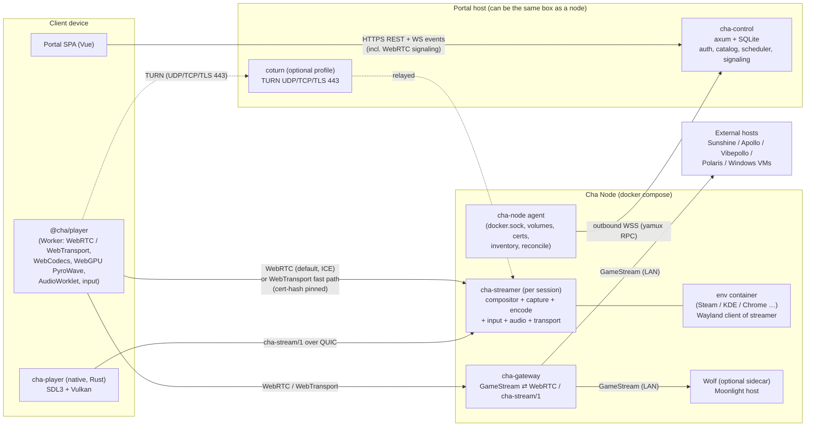

# Cha Portal: architecture and delivery plan

*Draft v0.1, 2026-10-03. Based on the research in [`docs/research/`](research/README.md).*

Cha Portal (portal.cha.sh) is a self-hosted dashboard for "portaling" into remote environments: a Chrome instance, a KDE desktop, Steam Big Picture, or an external Moonlight-protocol host. It aims for Moonlight-class latency in the browser or in a thin native client. Environments run on **Cha Nodes**, docker compose stacks on GPU servers that enroll with the portal and are driven by it.

---

## 0. TL;DR

- **Three tiers.**
  - `cha-control`: the portal API, auth, scheduling and signaling.
  - `cha-node`: an agent on each GPU server that dials *out* to the portal and reconciles containers.
  - `cha-streamer`: a per-session media engine with its own headless compositor, encoders and transport.

  The browser streams **directly from the node**. The portal only signals.
- **Two transports, one session model:**
  - **WebRTC is the universal baseline.** Every commercial cloud gaming service uses it in the browser, it is the only transport that works on Safari/iOS, it is exempt from Chrome's Local Network Access prompt, and ICE/TURN handle NAT. The node stamps `playout-delay` 0/0 so Chrome renders frames as soon as they arrive.
  - **WebTransport is the fast path** for Chromium and Firefox ≥153 when the node is directly reachable. It carries our own `cha-stream/1` framing: media and input on datagrams, control on one stream. This is where high-rate PyroWave lives.
  - The **native client uses raw QUIC** with the same framing. WebSocket is the last resort.
  - `cha-stream/1` is written once as a Sans-IO Rust crate: used by the streamer and the native client, compiled to wasm for the browser.
- **Codec ladder:**
  - **PyroWave** for wired LAN, decoded in the browser by a **WebGPU** port. Nobody ships this yet; it is our wedge.
  - **AV1/HEVC** with adaptive bitrate over WAN.
  - **H.264** for compatibility.
- **Borrow aggressively**, all licenses compatible with AGPL:
  - Wolf's MIT pieces: `wayland-display-core` compositor, `inputtino`, `fake-udev`, and the GoW container contract, so GoW images (Steam, etc.) run unmodified.
  - `moonlight-common-rust` for Moonlight hosts.
  - PyroWave and its WebGPU port.
  - Design patterns from Punktfunk (WebTransport certs, shared core) and Nestri (QUIC media-transport rules).
- **Bootstrap with Wolf.**
  - **MVP:** run Wolf unmodified on nodes and bridge its Moonlight stream to the browser through `cha-gateway`. Steam in the browser lands early, and the gateway is the same component that later serves external Sunshine/Vibepollo hosts.
  - **Next phase:** replace Wolf with `cha-streamer` as the default engine. Wolf stays as an optional "Moonlight compatibility" sidecar.
- **Stack:**
  - **Rust** for every backend and native component, with one shared protocol crate.
  - **Vue 3 + TypeScript** for the portal.
  - A **framework-agnostic TS player package**: Workers, WebCodecs, WebGPU.
- **Phase 0 is a set of go/no-go spikes**, chiefly: can a browser sustain PyroWave (300–800 Mbit/s over WebTransport datagrams *or* WebRTC unreliable data channels, plus a WebGPU decode) at native-class latency? The answer decides whether the native client or browser PyroWave comes first. Browser PyroWave can only ever reach browsers with WebGPU: Chrome on Windows/macOS/ChromeOS and some Linux GPUs, Safari 26+, and Firefox on Windows/macOS but **not Linux**.

---

## 1. Decisions and assumptions

| Topic | Decision | Source |
|---|---|---|
| Target scale | Homelab / small group first. Design so team scale is possible later. | User |
| License | **AGPL-3.0-or-later**. GPL-3 code (moonlight-common-rust, Sunshine bits) may be embedded. | User (approved 2026-10-03) |
| Network | LAN and WAN equally first-class → adaptive codec ladder | User |
| Exposure | **Strictly self-hosted.** No `cha.sh`-hosted relays, DNS or cert brokers. For remote access we recommend a tunnel/overlay such as **Tailscale** (also Headscale/NetBird/WireGuard). TURN stays an optional self-hosted add-on. | User (2026-10-03) |
| Baseline client | **MacBook Pro M4 + Google Chrome (macOS), wired 1 GbE, targeting 1440p60.** Every gate and benchmark is measured on this first. | User (2026-10-03) |
| Node test hardware | NVIDIA, AMD and Intel Linux boxes are all available | User (2026-10-03) |
| Priorities | Phase 2: **Chrome environment before KDE**. The Moonlight *host* façade stays in "Later", because `cha-stream/1` is the first-class protocol. | User (2026-10-03) |
| Backend language | **Rust** (control plane, node agent, streamer, gateway, native client) | Recommendation, approved |
| Frontend | **Vue 3 + TS + Vite** | Recommendation, approved |
| Node OS | Linux x86_64, Docker Engine (rootful) with NVIDIA CDI or `/dev/dri` | Assumption |
| GPUs | All three vendors from the start: NVIDIA (NVENC, CUDA/Vulkan import), AMD and Intel (VA-API, Vulkan Video). PyroWave needs only Vulkan compute. | User hardware + assumption |
| Windows/macOS | Not node hosts. Windows machines join as **external endpoints** (Vibepollo/Sunshine in guest or on bare metal). | Assumption |
| Isolation | Plain containers, never `--privileged`, per-template security profiles. MicroVMs later. | Fits homelab scope |

---

## 2. Architecture

### 2.1 Component map



### 2.2 Components

| Component | Responsibility | Key deps (borrowed) |
|---|---|---|
| **`cha-control`** | Users, passkeys/OIDC, RBAC, node registry and enrollment, catalog/templates, environment lifecycle, placement, session brokering (WebRTC SDP relay to the node, WebTransport candidates + cert hashes, media tokens, short-lived TURN credentials), share links, audit log, serving the SPA | axum, sqlx (SQLite → Postgres later), webauthn-rs, openidconnect, utoipa (OpenAPI → TS client). coturn as a sidecar. |
| **`cha-node`** | Enrollment, one outbound WSS channel (yamux + RPC), GPU/encoder/Vulkan inventory, desired-state reconciliation, image pulls, volumes (`dir`/`zfs`/`btrfs`), streamer and gateway process lifecycle, WebTransport cert rotation, Wolf adapter, `cha doctor` preflight | bollard, yamux, nvml-wrapper, ash (Vulkan probe) |
| **`cha-streamer`** | One per running environment. Headless Wayland compositor → zero-copy DMA-BUF capture → encoder fan-out (PyroWave / HW codecs) → **WebRTC endpoint (ICE-lite) + WebTransport/QUIC endpoint**. Keyboard and mouse injected into the compositor, gamepads via inputtino plus hotplug into the env container, audio capture → Opus. Multi-viewer producer/consumer. | `wayland-display-core` (Wolf, MIT) or `pixelflux` (MPL), inputtino, pyrowave, gstreamer-rs (nvcodec/va/qsv/vulkan), **str0m** (WebRTC, sans-IO, TWCC/BWE, playout-delay), wtransport/quinn, opus |
| **`cha-gateway`** | Bridges GameStream hosts (local Wolf, external Sunshine/Apollo/Vibepollo/Polaris) to the same WebRTC/WebTransport endpoints. Passes H.264/HEVC/AV1 **and PyroWave** through, no transcoding. Rewrites H.264/HEVC VUI to `max_num_reorder_frames=0` when the host doesn't, so hardware decoders don't buffer. Translates input. Handles pairing. | moonlight-common-rust (GPL-3), the moonlight-web-stream v3 design (WebRTC passthrough) |
| **`cha-proto`** | Sans-IO protocol core: message schema, datagram framing, fragmentation, FEC, reassembly, jitter/deadline logic, congestion-control feedback, input encoding. Compiled to wasm for the browser. | Leopard-RS-class FEC crate, prost/serde |
| **Portal SPA** | Dashboard, catalog, launch/connect, node admin, session overlay UI | Vue 3, Vue Router, Pinia, TanStack Query, a Tailwind-based component kit |
| **`@cha/player`** | Framework-agnostic TS player: transports, decoders, renderer, audio, input, stats overlay. Runs the hot path in Workers. | `cha-proto` wasm, `@cha/pyrowave-webgpu` |
| **`cha-player`** (native) | Thin client: raw input, VRR/HDR, Vulkan present, HW decode, PyroWave. Launched from the portal via `cha://` deep link plus a one-time ticket. | SDL3, ash, ffmpeg-next (hwaccel), pyrowave |
| **coturn** (optional portal profile) | TURN over UDP/TCP 3478 and **TLS 443** for WebRTC on CGNAT nodes and restrictive client networks, with ephemeral REST-API credentials minted by `cha-control` | coturn (BSD-3) or eturnal |

### 2.3 Launch and connect flow

```mermaid
sequenceDiagram
  participant B as Browser (SPA + player)
  participant C as cha-control
  participant A as cha-node
  participant S as cha-streamer
  participant E as env container

  B->>C: POST /environments {template}
  C->>C: placement (requirements, load, volume locality, client RTT probes)
  C->>A: desired state: env X on node (over WSS RPC)
  A->>A: pull image (digest), prepare volume, allocate GPU + UDP port
  A->>S: start streamer (compositor up, Wayland socket ready)
  A->>E: start env container (GoW contract: WAYLAND_DISPLAY, PULSE_*, devices, /home)
  A-->>C: env Running {addrs: LAN/overlay/public, WT cert hash signed by node key}
  B->>C: POST /environments/X/connect {decode caps, WebGPU caps, display mode}
  C-->>B: {mediaToken (Ed25519, 60 s), TURN creds, WT candidates + certHashes, codec policy}
  par WebRTC baseline (always)
    B->>C: SDP offer (via portal WS)
    C->>A: forward to streamer
    A-->>C: SDP answer (ICE-lite: host/srflx/TCP candidates)
    C-->>B: answer → ICE/DTLS → video track + data channels
  and WebTransport upgrade (Chromium / Firefox ≥153, if reachable)
    B->>S: WebTransport race to candidates (serverCertificateHashes)
  end
  B->>S: Hello {token, caps, measured bw} on the first transport up
  S-->>B: Config {transport, codec, mode, tier}; media flows
  Note over B,S: if WT connects and the probe passes, hot-switch to it (IDR or fresh PyroWave frame)
  B-->>S: input / control msgs / receiver reports
```

**Environments outlive connections** (Wolf's "lobby" semantics). Disconnecting leaves the environment running until its idle timeout. Reconnecting gets a fresh keyframe.

---

## 3. Streaming design

### 3.1 `cha-stream/1` protocol and transport mapping

One logical session with the same messages on every transport. Only the carrier changes:

| Logical channel | WebRTC (baseline, all browsers) | WebTransport (fast path) / native QUIC | WebSocket (last resort) |
|---|---|---|---|
| **Control**: Hello/Config, mode changes (resize/refresh/scale), codec/tier switch, keyframe/RFI requests, clipboard, cursor shape, IME text commit, rumble/LED/haptics, stats summaries | Reliable ordered DataChannel `control` | 1 bidi stream | Same framing, multiplexed |
| **Video, H.264/HEVC/AV1** | **RTP video track** (str0m packetization), `playout-delay` 0/0, `abs-capture-time`, NACK, adaptive FlexFEC/RED, TWCC → node-side GCC. Browser decodes natively. | Datagrams with `cha-stream/1` framing `{ver, stream_id, frame_id u32, frag_idx, frag_cnt, fec_meta, flags(key/critical/last), send_ts_us}` + Leopard-RS FEC. Decoded with WebCodecs. | Frames on TCP with frame-ACK backpressure |
| **Video, PyroWave** | Unreliable, unordered DataChannel `media` with `cha-stream/1` framing → WebGPU. Throughput unproven; S1 decides. | Datagrams, critical packets duplicated or FEC'd → WebGPU (browser) or Vulkan/Metal (native) | Not offered |
| **Audio** | RTP Opus track | Datagrams: Opus 48 kHz, 5–10 ms frames with RED | Framed |
| **Input**: mouse rel/abs, gamepad *state snapshots* (loss-tolerant, sequence-numbered, coalesced) | Unreliable/unordered DataChannel `input` (GeForce NOW-style partial reliability for pads) | Datagrams | Framed |
| **Input**: key/button edges, text | Reliable DataChannel `control` | Control stream | Framed |
| **Feedback**: per-frame receive reports (first/last fragment arrival, fragments received, decode-done, presented-at), clock-sync pings | RTCP/TWCC + `getStats()`/`requestVideoFrameCallback` summaries on `control` | Datagrams, batched about every frame | Framed |

The WebTransport and native QUIC paths share one `wtransport`/quinn endpoint in the streamer. The WebRTC path is a str0m endpoint (ICE-lite) on the same node. Keyframes on the QUIC path go either on short-lived uni streams or on datagrams with FEC; the Phase 0 spike decides, watching for datagram-before-stream starvation (Nestri).

Rules carried in from the research (Nestri `media-transport.md`, Punktfunk, Vibepollo):

1. **Receiver truth wins.** Congestion control is driven by receiver reports and **send-queue duration** (`backlog_ms`), not by loss. Loss is a lagging signal.
2. **No silent eviction.** Wrap `send_datagram` so drops are counted. Backpressure goes *before the encoder* (skip or capture fewer frames). We never drop an encoded reference frame.
3. **No app-level pacing on QUIC.** QUIC already paces, so we produce less instead.
4. **ResyncGate.** Never send frames that depend on a reference the receiver lacks. On loss: RFI/LTR if the encoder supports it, else intra-refresh, else IDR, bounded in time.
5. **Newest-frame-wins.** If a frame is still queued when the next one is ready, replace it.
6. **Unequal protection.** PyroWave gets FEC (or duplication) on *critical* packets (coarsest band) only, decodes partial frames at the deadline, and needs no keyframes. H.26x/AV1 get per-frame adaptive Leopard-RS FEC (GF(2^16), no ~1 Gbps ceiling).
7. **Protocol versioning from day one.** Explicit wire version, codec bitstream IDs (PyroWave pinned by commit until it has a version field), and capability negotiation in Hello.
8. **1-in-1-out decode.** Low-delay encoder config: no B-frames, VBV of about 1 frame, slices or intra-refresh. Write H.264/HEVC VUI `bitstream_restriction` with `max_num_reorder_frames=0`, as Sunshine's `cbs.cpp` does. Without it, browser hardware decoders hold about 4 frames.
9. **A media-aware QUIC congestion controller.** S1 showed quinn's BBR adds 50–130 ms p99 stalls. Its BDP-sized cwnd is smaller than one frame on a LAN, and it enters ProbeRTT every 10 s. Cubic is only fine because its cwnd grows unbounded on a loss-free LAN. `cha-streamer` gets its own quinn `Controller`:
   - cwnd floor of at least 1–2 frames;
   - no probe phases;
   - rate set from receiver reports and send-queue duration (rule 1).
10. **Measure the WebRTC path too.** The per-frame header (frame-id, capture µs, encode µs) rides in an encoded-transform trailer on RTP, or in the packet header on WebTransport/WebSocket. Chrome's low-latency renderer assumes 60 fps internally, so validate at 120/144 Hz.

### 3.2 Codec ladder and tier selection

| Tier | When | Codec | Typical rate | Notes |
|---|---|---|---|---|
| **L (LAN wired)** | Probe ≥ ~400 Mbit/s, RTT < 3 ms, and either the native client, or a browser with WebGPU (subgroups or the fallback path) plus a transport that sustains the rate (WebTransport, or a DataChannel if S1 shows it can) | **PyroWave** 4:4:4 (desktop) / 4:2:0 (games) | 200–900 Mbit/s (1080p60 → 4K60; ×2 at 120 fps) | Encode is ~0.2–0.3 ms of GPU work at 1440p on an RTX 4090 (S1e); browser decode is 2–6 ms on an M4 Pro (S1b/S1c). Skip unchanged frames (damage) and send periodic heal frames. 1 GbE tops out around 1440p60 4:4:4. **Wire time dominates on 1 GbE**: a 590 Mbit/s 1440p60 frame takes ~10.5 ms to serialize (4:2:0 at 290 Mbit/s: ~5 ms), so expose a quality ↔ latency byte cap. |
| **M (fast LAN / Wi-Fi / fat WAN)** | 40–300 Mbit/s | **HEVC/AV1 10-bit**, 4:4:4 where encoder *and* decoder support it | 40–150 Mbit/s | Intra-refresh, LTR/RFI, slices |
| **W (WAN)** | Everything else | **AV1 → HEVC → H.264** by client decode caps. **Prefer HEVC on Safari**: AV1 decode needs M3/A17 Pro or newer there. | 5–50 Mbit/s adaptive | Delay-based ABR (GCC on WebRTC, queue-based on QUIC), FEC, RFI |
| **Compat** | Old/odd clients | H.264 | — | Always available |

- **S1c result (baseline LAN, 2026-10-03).** Time from send to on-screen, p50 (encode not included): H.264 6.9 ms, AV1 8.0, HEVC 8.0–8.7, PyroWave 4:2:0 11.4, PyroWave 4:4:4 20.0. On 1 GbE + M4 Pro, hardware codecs are the default tier.
- **S1e result (RTX 4090, 2026-10-03).** Encode p50 at 1440p60: NVENC H.264/HEVC/AV1 1.7–2.2 ms; PyroWave 0.21 ms (4:2:0) and 0.33 ms (4:4:4) of GPU work, 1.0 and 1.9 ms wall clock through the WebGPU port. With encode added, the hardware codecs reach the screen ~2.5–3.5 ms before PyroWave 4:2:0 on the baseline (H.264 ~8.9 ms, HEVC ~9.8, PyroWave ~12.4). S1c's predicted tie doesn't happen. S1d then found a faster present path for hardware codecs, track generator → `<video>`, which saves another 4–5 ms against the WebGPU draw S1c used: ~5 ms (hardware) vs ~12.4 ms (PyroWave 4:2:0) from encode to compositor. PyroWave pulls ahead only on fast links (~10 GbE, by ~1–2 ms) or when decode is cheap (desktop GPUs). See `spikes/s1c-codec-compare/README.md` and `spikes/s1e-encode-latency/README.md`.
- **Measure, don't assume (S1b).** A client's PyroWave decode cost depends on its GPU *and its clock behaviour*. An M4 Pro takes ~6 ms per 1440p frame at a 60 fps duty cycle against ~1.3 ms warm. The client therefore runs a short decode probe at the target cadence, alongside the bandwidth probe, and Tier L is only chosen when PyroWave's wire time plus decode beats the hardware codec path measured the same way.
- **Negotiation.**
  - The client probes `VideoDecoder.isConfigSupported()` and `RTCRtpReceiver.getCapabilities()` / MediaCapabilities for each codec with HW acceleration.
  - It checks WebGPU (and subgroups) and runs a short bandwidth probe (Vibepollo-style, a few MiB).
  - The streamer picks the transport and tier, and can **switch live** (new keyframe, or a fresh PyroWave frame) when conditions change.
- **Real-world decode coverage** (2026 dataset in research 05):
  - AV1 is about 91% on Chrome/Firefox but only about 30% on Safari.
  - HEVC is near-universal on Safari but almost nil on Firefox.
  - Neither Chrome nor Firefox decodes HEVC on Linux.
- **Text clarity.** Desktop templates prefer PyroWave 4:4:4 on LAN. On WAN they prefer AV1/HEVC 4:4:4 if the client can decode it. Otherwise they render the cursor client-side and accept 4:2:0.

### 3.3 PyroWave, first-class

1. **Node encode.** Link libpyrowave (C API, commit-pinned) or `nespyro`.
   - Share the compositor's Vulkan device and import the DMA-BUF with modifiers. Run one scaled encode that does RGB→YCbCr, crop and scale, and HDR10.
   - Use a realtime compute queue (`CAP_SYS_NICE` on the streamer only).
   - It uses **no NVENC session**, which matters for many sessions on one GeForce.
   - Set the per-frame byte cap from the congestion controller.
2. **Wire.** Fragment PyroWave packets into WebTransport/QUIC datagrams, or into unreliable WebRTC DataChannel messages; blocks can be about 16 KB, so fragmenting is mandatory. Duplicate or RS-protect critical packets. The receiver assembles until a deadline, then decodes what it has (local blur on loss).
3. **Browser decode.** `@cha/pyrowave-webgpu` is a fork of `imbcmdth/pyrowave@webgpu` (MIT).
   - Decode **directly into a GPUTexture** that the renderer samples. No CPU readback, unlike the upstream port.
   - Add a **subgroup-free dequant path** (workgroup-memory scans), because subgroups are Chrome-only.
   - Validate bit-exactness against the Vulkan build in CI.
   - **Reach**: Chrome on Windows/macOS/ChromeOS, plus Chrome on Linux with Intel Gen12+ or NVIDIA on Wayland (AMD needs a flag); Safari 26+ (over the DataChannel path, because WebKit's WebTransport is broken); Firefox on Windows and Apple Silicon. **Firefox on Linux has no WebGPU**, so those users get Tier M/W or the native client.
4. **Native decode.** libpyrowave on Vulkan (Linux/Windows/Android) and its Metal port (macOS/iOS).
5. **Interop.** `cha-gateway` implements **Vibepollo's PyroWave-over-GameStream contract** (capability bits, `bitStreamFormat=3`, record framing, critical-band FEC). A Vibepollo or Polaris host on the LAN can then be played in the **browser** with PyroWave, which nobody offers today.
6. **Upstream relations.** Track the Wolf PR #517 GStreamer element and ask Themaister for a bitstream version field. Coordinate capability-bit registration with Nonary and LizardByte.

### 3.4 Multi-viewer and sharing

- **Producer/consumer** (Wolf's interpipe pattern). There is one compositor/capture producer per environment. Each viewer gets its own encoder instance, so viewers can differ in codec, tier and resolution. Viewers with identical parameters share one encoder.
- **Roles:**
  - `owner`
  - `controller` (keyboard/mouse; one at a time, Neko-style request/give/take)
  - `player-N` (gamepad slot N)
  - `viewer` (no input)

  Roles are carried in the media token. Share links are signed and expiring, Selkies-secure-mode style.

### 3.5 Input, audio, cursor, clipboard

- **Keyboard and mouse** go straight into the streamer's compositor as Wayland seat events, or via gamescope's EIS socket for games. No uinput is needed.
  - Relative mode (pointer lock, raw) suits games; absolute mode suits desktops.
  - Keys are sent by `KeyboardEvent.code` with a layout hint, and IME text is committed separately.
- **Gamepads.** In the browser, Gamepad API state snapshots; optionally WebHID for DualSense gyro, touchpad and adaptive triggers. On the node, `inputtino` creates the virtual pad (Xbox/DualSense/Switch) and **hotplugs it into the env container** with Wolf's `mknod` + `fake-udev` recipe. Host udev rules (installed by `cha doctor`) keep the virtual pads away from the host seat.
- **Cursor.** In desktop mode the cursor is rendered client-side from cursor-shape and position messages, so it feels local. In game mode it is composited into the video.
- **Audio.** Per-session PipeWire/Pulse null sink → Opus.
  - On WebRTC it is a native RTP audio track.
  - On QUIC it goes as datagrams with RED, played client side via `AudioDecoder` + an `AudioWorklet` ring buffer (about 20–40 ms target).
  - Mic uplink comes later via a virtual source.
- **Clipboard.** Text in both directions over the control stream using the Async Clipboard API, gated per template. Files come later.

### 3.6 Latency targets and measurement

| Path | Target glass-to-glass (p50) |
|---|---|
| Native client, wired LAN, PyroWave, 120 Hz | ≤ 12 ms |
| Browser (Chrome), wired LAN, PyroWave, 120 Hz | ≤ 20 ms (the browser compositor adds about one frame) |
| **Baseline**: Chrome on M4 MacBook Pro, 1 GbE, PyroWave 1440p60 4:4:4 | ≤ 25 ms (the 60 fps cadence on a 120 Hz panel adds up to one stream frame of wait; 4:4:4 alone spends ~10.5 ms on the 1 GbE wire, so 4:2:0 or a lower byte cap may win on latency) |
| Browser, WAN, AV1 | one-way network + ≤ 20 ms |

These are targets to validate in Phase 0, not measured facts.

- Every frame carries `frame_id` plus capture, encode-done and send timestamps. The client adds first/last-fragment arrival, decode-done and presented-at (`requestVideoFrameCallback` / WebGPU submit completion), with clock offset from control-stream pings.
- A **stats overlay** and a once-per-second stats line on the node: present, admitted, encoded, sent, starved, dropped, queue ms. Nestri's rule applies: "a change that moves none of these numbers should be reverted."
- A **latency-test environment** renders the frame counter and a **frame-ID strip** in a corner, so drops, repeats and reorders show up, and flashes on input.
- A **click-to-photon rig** measures input-to-photon: a Teensy/RP2040 posing as a USB mouse plus a photodiode, or the open-hardware OSLTT.
- **Baselines**: the same app run locally, and native Moonlight against the same host, at 60/120/240 Hz and under netem WAN profiles. Report p50/p95/p99 plus stutter counts. These tests run before and after any transport change.

---

## 4. Environments

### 4.1 Classes

| Class | How it runs | Phase |
|---|---|---|
| **Gaming (Steam & co.)** | GoW Steam image, unmodified, via the GoW contract. Steam Big Picture under nested gamescope/sway inside our compositor. Also RetroArch, Lutris, Heroic, ES-DE, etc. | MVP via Wolf → Phase 2 on `cha-streamer` |
| **Browser** | Chrome/Chromium with `--ozone-platform=wayland` as a Wayland client. Neko-derived enterprise policies (kiosk, downloads, extensions). Custom seccomp so Chrome's sandbox stays on (no `--no-sandbox`). | Phase 2 (Firefox via GoW in MVP) |
| **Full desktop** | KDE Plasma: nested `kwin_wayland --xwayland` under `dbus-run-session`, PipeWire + WirePlumber, no systemd (linuxserver webtop recipe). XFCE via GoW. Prototype `kwin_wayland --virtual` + libei later. | XFCE MVP via Wolf → KDE Phase 2 |
| **External GameStream host** | Sunshine / Apollo / Vibepollo / Polaris / Wolf on another machine. `cha-gateway` runs on a Cha Node on the same LAN. | Phase 3 (Wolf-local in MVP) |
| **Compat web desktops** | Existing Selkies/webtop, KasmVNC, Neko containers launched by the node; their web client is proxied behind portal auth | Later (cheap win) |
| **Windows VM** | libvirt/QEMU with GPU passthrough or Intel SR-IOV. Vibepollo in the guest, treated as an external GameStream host. | Later |
| **RDP/VNC/SSH** | Bundled `guacd` | Later |

### 4.2 Container contract and security profiles

- **GoW container contract**, implemented exactly so GoW images run unmodified:
  - Variables: `XDG_RUNTIME_DIR`, `WAYLAND_DISPLAY` with a socket bind mount, `PULSE_SERVER/PULSE_SINK/PULSE_SOURCE`, `GAMESCOPE_WIDTH/HEIGHT/REFRESH`, `PUID/PGID`.
  - Mounts: `/home/retro` volume and `fake-udev` with a private `/run/udev`.
  - Devices: GPU render node or NVIDIA CDI, plus device-cgroup rules for the `input`/`hidraw` majors (read from `/proc/devices`).
  - Cha-native images use the same contract plus Cha labels.
- **Security profiles**, chosen per template and never `--privileged`:
  - `standard`: render node, default seccomp, no extra caps.
  - `browser`: `standard` plus a seccomp profile that lets Chrome's sandbox create user namespaces.
  - `steam`: user namespaces for pressure-vessel via a **custom seccomp/AppArmor profile**. Fallback is Wolf's `SYS_ADMIN` + unconfined + patched bwrap, chosen after the Phase 0 spike.
  - `gamepad`: device-cgroup rules for hotplugged pads (needs a rootful runtime).
- Only `cha-node` is root-equivalent (docker.sock, `/dev/uinput`, `/dev/uhid`, host udev rules). Keep it small and audited.

### 4.3 Catalog

- A **git/HTTPS-hosted JSON registry** modelled on Kasm's `list.json` (schema 1.1). Images are pinned by digest, with optional cosign verification. Cha adds fields for:
  - class and security profile
  - GPU requirements and preferred codecs/tier
  - persistence policy
  - default mode
  - pool size
- **Importers** for the Kasm registry, Wolf `config.toml` apps and linuxserver/Selkies images.
- The node **pre-pulls** images flagged as pinned for that node.

### 4.4 Persistence

- **Ephemeral:** the container and an anonymous volume, destroyed on stop or idle timeout. Optionally pre-warmed pools later (Kasm "staging").
- **Persistent:** a **home volume per (user, template)**, mounted at the image's home (e.g. `/home/retro`). The container is *recreated from the image* on every start (Kasm model). This means:
  - image upgrades are free;
  - a "Reset to template" button just swaps the volume.
- **Volume drivers:** `dir` by default; `zfs` and `btrfs` give instant clones of golden homes, snapshots, and `send/recv` migration between nodes. Backups via restic/kopia to S3 come later.
- **Suspend** means stopping the container and keeping the volume. A running GPU session can't be checkpointed.
- **Shared Steam library** (experimental, Phase 3): a read-only lower layer plus a per-user overlay upper. Concurrency is a known open problem (Wolf #69/#83).
- **Placement:** a persistent environment sticks to the node holding its volume until it is explicitly migrated.

---

## 5. Control plane and nodes

### 5.1 Enrollment, channel, reconciliation

1. An admin clicks "Add node" and gets a **one-time join token** (128-bit, 60-minute TTL, stored hashed). The token embeds the portal URL plus a **pin of the portal's TLS cert/CA**, in the style of k3s `K10<hash>::`.
2. On the node, `docker compose up` with `CHA_JOIN_TOKEN=…`. The agent generates an **Ed25519 node key** and redeems the token. The portal stores the public key. After that, the node authenticates at the application layer with its key, which works through any reverse proxy.
3. The agent holds **one outbound WSS** connection, multiplexed with yamux and carrying protobuf RPC in both directions, as Coder does with dRPC. Heartbeats every 30 s; the node counts as offline after 3 misses (Nestri).
4. **Desired-state reconciliation.** The portal writes desired environment state and the agent converges, so disconnects heal themselves. Commands are idempotent.
5. **Inventory**, refreshed on change:
   - GPUs (vendor, model, VRAM, driver)
   - available encoders (NVENC/VA-API/Vulkan Video profiles, 4:4:4/10-bit support)
   - Vulkan compute capability (PyroWave)
   - free NVENC sessions (12 per GeForce)
   - disks and volume drivers
   - reachable addresses (LAN, overlay, public)
   - port range
6. **Agent upgrades**: self-update with rollback. The agent is **never in the media path**, so restarting it doesn't drop sessions.
7. **`cha doctor`** preflight checks for:
   - driver ≥ 580 and `nvidia-drm.modeset`
   - CDI config
   - `/dev/uinput`, `/dev/uhid` and udev rules
   - render nodes
   - open UDP ports
   - NTP sync (certs rotate every 13 days)
   - Docker version and storage quota support

### 5.2 Networking and certificates

- **Addresses.** Each streamer knows the node's LAN IPs, overlay IPs (Tailscale/NetBird/WireGuard if present; optional, never required), and public IP and port if forwarded.
  - For **WebRTC** these become ICE host and srflx candidates, plus passive ICE-TCP. The streamer runs ICE-lite, like GeForce NOW.
  - For **WebTransport** the player **races** connections to every address and keeps the fastest.
  - Candidate RTTs also feed placement, CloudRetro-style.
- **Ports.** Each streamer gets one UDP port from a node range (default `47000–47099/udp`), shared by its ICE and QUIC endpoints (demuxed by first byte). A single node-wide port can come later.
- **Certificates:**
  - **WebRTC** needs no CA: DTLS fingerprints travel in the SDP, which the portal relays over authenticated channels.
  - **WebTransport** uses the Punktfunk scheme:
    - Each streamer endpoint uses an in-memory **ECDSA P-256 self-signed cert valid 13 days**, rotated a day early.
    - The node signs the cert hash with its long-lived Ed25519 key, and the portal hands the hash to the browser for **`serverCertificateHashes`**.
    - This needs no public CA and no DNS, and works on bare LAN IPs.
    - An optional ACME/DNS-01 mode for people with a domain comes later.
- **Chrome Local Network Access.** A portal on a public origin opening a **WebSocket or WebTransport** to private IPs triggers a permission prompt (Chrome 147+). **WebRTC is exempt**, which is another reason it is the baseline.
  - Document **split-horizon DNS** (portal reachable on the LAN at the same name) as the recommended setup for the WebTransport fast path.
  - Detect and explain the prompt in the UI.
- **Fallback chain for CGNAT nodes and restrictive client networks** (decided per session by a fast race):
  1. WebRTC direct UDP
  2. WebRTC via TURN-UDP
  3. TURN-TCP / **TURN-TLS on 443** (coturn on the portal host, short-lived REST-API credentials)
  4. WebSocket on 443 with reduced fps/bitrate

  WebTransport needs direct reachability: a port forward or an overlay. **PyroWave is never relayed.**
- **Recommended remote-access setup (self-hosted only).** Put the portal *and* the nodes on a **Tailscale** tailnet (or Headscale/NetBird/WireGuard).
  - Nodes advertise their overlay IPs as candidates.
  - The portal is served on the tailnet with HTTPS (`tailscale serve` / `*.ts.net` certs). The browser then reaches the portal and the nodes over the same private network, so there is no public-origin→private-IP LNA prompt, no port forwarding, and no TURN.
  - Expect WAN-tier codecs over the tunnel. PyroWave stays a direct-LAN tier.
  - coturn remains an optional compose profile for people who expose the portal publicly.
- **Control plane exposure.** Any reverse proxy, including Cloudflare Tunnel, is fine for the portal. **Media cannot go through Cloudflare Tunnel**, because it carries no UDP and the ToS restricts video.

### 5.3 Auth and authorization

- Built-in accounts with **passkeys** (webauthn-rs) and an optional generic **OIDC** provider (Pocket ID, Authelia, Authentik, Keycloak).
- Roles: `admin`, `user`, `guest`. Templates are granted to users or groups. Per-user quotas (concurrent environments, GPU) can come later.
- **Media tokens** are Ed25519-signed by the portal: `aud=node`, `sid`, `env`, `role`, input scopes, `exp ≤ 60 s`. The streamer verifies them **offline** with the portal's public key, which it receives at enrollment.
- **Share links** are signed and expiring, and carry a role (viewer / controller / player-N). An optional PIN.
- **Audit log** (append-only): logins, launches, connects, shares, admin actions.

### 5.4 Data model (initial)

`users`, `passkeys`, `oidc_identities`, `groups`, `join_tokens`, `nodes` (pubkey, status, inventory JSON, candidates), `templates`, `template_grants`, `environments` (owner, template, node, state, persistence, volume_id, idle_timeout), `volumes` (driver, node, size, snapshots), `connections` (env, user, role, client kind, codec/tier, timings, summary stats), `share_links`, `external_hosts` (address, pairing cert, gateway node), `audit_log`.

**Environment state machine:** `requested → scheduled → preparing (pull/volume) → starting → running ⇄ streaming → stopping → stopped (persistent) | destroyed (ephemeral)`, with `failed` reachable from any state and a reason.

---

## 6. Clients

### 6.1 Browser player (`@cha/player`)

- **Threads.**
  - The main thread does only DOM, fullscreen/lock and input capture. Input goes to the worker over a `MessagePort`, or straight onto a transferred DataChannel.
  - A **media Worker** owns the transport, `cha-proto` (wasm), WebCodecs decode, PyroWave decode, and rendering into an `OffscreenCanvas`.
  - The audio decoder feeds an **AudioWorklet** ring buffer.
  - The portal serves **COOP/COEP** headers from day one, for SharedArrayBuffer ring buffers and fine-grained timers.
- **Transport adapter**, one interface with four implementations:
  1. **WebRTC** (default): the video/audio RTP tracks are rendered by the browser's native low-latency pipeline (playout-delay 0/0, `jitterBufferTarget=0`), plus DataChannels for control, input and feedback.
  2. **WebRTC DataChannel-only** for custom codecs (PyroWave): `cha-stream/1` framing on an unreliable channel, decoded in the worker.
  3. **WebTransport** (upgrade on Chromium/Firefox ≥153 when reachable): datagrams plus a bidi stream; WebCodecs or PyroWave decode. **Disabled on WebKit** until WebKit bug 319818 (flow-control deadlock) is fixed, like moq.dev does.
  4. **WebSocket** last resort.
- **Decode:**
  - The browser's native WebRTC decoder on the RTP path.
  - WebCodecs `VideoDecoder` (`optimizeForLatency: true`, prefer hardware) for H.264/HEVC/AV1 on the framed paths.
  - **WebGPU compute** for PyroWave.
- **Render** (framed paths), in order of preference. Measured in S1d on the baseline; times are send → compositor, p50.
  1. Hardware-decoded `VideoFrame`s → **track generator → `<video>`**: 2.7–3.4 ms, p95 4.5–5.9.
     - Use `VideoTrackGenerator` in the decode worker where available, and Chrome's main-thread `MediaStreamTrackGenerator` otherwise.
  2. 2D canvas `drawImage`: 2.3–3.5 ms, but p95 8.8–9.5 because it waits for the next rendering update.
  3. **WebGPU only for PyroWave**, sampling its output texture directly.
     - Drawing hardware-decoded frames through `importExternalTexture` cost 4–5 ms more (7.3–8.9 ms).
     - WebGL2 with `desynchronized: true` is honoured only on Windows and ChromeOS.

  Present on the next vsync, never queue more than one frame, and close `VideoFrame`s immediately.
- **Input.**
  - Pointer Lock with `unadjustedMovement` for raw mouse: Chrome except on Linux, Firefox 152, Safari 18.4. There is no pointer lock on iOS.
  - `pointerrawupdate` / `getCoalescedEvents()` so every mouse delta is sent, not one per frame.
  - IME via a hidden `<textarea>` with composition events; committed text is sent as a text event, and raw keydown forwarding is suppressed while composing.
  - Keyboard capture (Esc, Alt-Tab, Win/Cmd) differs by browser: `navigator.keyboard.lock()` on Chromium, `requestFullscreen({keyboardLock: "browser"})` on Firefox 151 and Safari 26.4. Feature-detect both.
  - Gamepad API polled every frame (Chromium samples at 250 Hz internally). Rumble via `vibrationActuator`; trigger rumble is Chrome-only.
  - WebHID DualSense opt-in (Chromium desktop) for gyro, touchpad, lightbar and adaptive triggers.
  - Touch overlays: trackpad mode and virtual gamepad.
  - Expect Chrome's planned permission prompts for pointer and keyboard lock.
- **UX.**
  - An in-stream overlay menu: Ctrl+Alt+Shift+Q-style hotkey plus a corner hotspot on touch.
  - Stats HUD with codec, tier, bitrate, per-stage latency, loss and queue.
  - Explicit "why it's slow" hints: no HW decode, no WebGPU subgroups, Local Network Access prompt, Wi-Fi detected.
- **Per-browser caveats** (details in research 05 §9.3):

| Browser | Transport | Codecs (WAN) | PyroWave | Notes |
|---|---|---|---|---|
| Chrome/Edge (Win/macOS/ChromeOS) | WebRTC → WebTransport upgrade | AV1, HEVC, H.264 | ✅ (subgroups) | Best everywhere. LNA prompt for WebTransport/WebSocket to private IPs. |
| Chrome (Linux) | same | AV1, H.264 (no HEVC) | Intel Gen12+, or NVIDIA on Wayland; AMD needs a flag | No raw mouse; hardware decode is spotty |
| Firefox (Win/macOS) | WebRTC → WebTransport (≥153) | AV1, H.264 | ✅ (fallback shader, no subgroups) | Keyboard lock via fullscreen option (151) |
| Firefox (Linux) | same | AV1, H.264 | ❌ (no WebGPU) | Use Tier M/W or the native client |
| Safari (macOS) | **WebRTC only** | **HEVC**, H.264 (AV1 only on M3+) | DataChannel path if S1 passes | Keyboard lock via fullscreen option (26.4); raw pointer (18.4) |
| iOS/iPadOS | WebRTC only, as an installed PWA | HEVC, H.264 | Possibly (WebGPU in Safari 26), low priority | No pointer/keyboard lock or haptics; iPhone has no element fullscreen. Touch-first UX. |

### 6.2 Native thin client (`cha-player`)

- **Rust**: SDL3 for windowing, raw input, gamepads/haptics and HID; ash/Vulkan for presentation and VRR/HDR swapchains.
- **Decode**: FFmpeg hwaccel (Vulkan Video, D3D11VA, VideoToolbox, VAAPI) plus libpyrowave on Vulkan or Metal.
- **Shared code**: the same `cha-proto` and transport as the streamer.
- **Launch**: the portal stays in the browser. "Open in Cha Player" uses a `cha://connect?ticket=…` deep link with a one-time ticket that is exchanged for candidates, hashes and a token.
- **Targets**: Linux (incl. Steam Deck Game Mode), Windows, macOS. Android and iOS/tvOS come later through a Rust core with uniffi bindings.
- **References**: Magic Mirror `mm-client` (MIT) for structure; moonlight-qt (GPL-3) for frame pacing, HDR and raw input.
- **Not Tauri**: WKWebView pointer lock needs private API, and WebKitGTK lacks WebTransport/WebCodecs.

---

## 7. Observability and ops

- Prometheus metrics from portal, agent and streamer (per-session stats, encoder load, NVENC sessions, GPU utilisation) and structured logs (tracing).
- Session timeline in the portal: connection attempts per candidate, tier switches, keyframe requests, a stats sparkline.
- `cha doctor` (node) and a "connection test" page in the browser (decode caps, WebGPU features, bandwidth/RTT to each node).
- Deploy artifacts:
  - `deploy/portal/compose.yaml` (`cha-control`, with an optional `turn` profile for coturn)
  - `deploy/node/compose.yaml` (with profiles: `wolf`, `gateway`)
  - `deploy/allinone/compose.yaml` (portal + node on one box, the most common homelab setup)

---

## 8. Stack and repository layout

**Why Rust everywhere on the backend.**
- One language for every component that speaks `cha-stream/1`, with a shared protocol crate (also compiled to wasm for the browser).
- First-class QUIC (quinn, wtransport, iroh), a sans-IO WebRTC stack (str0m), Smithay (compositor), inputtino and PyroWave bindings already exist in Rust.
- moonlight-common-rust is Rust.

Go would be the credible alternative for the control plane only (tsnet/Headscale embedding, pion, Coder reuse). Its cost is a split protocol implementation.

```
portal.cha.sh/
├─ Cargo.toml                    # workspace
├─ crates/
│  ├─ cha-proto/                 # Sans-IO wire protocol, FEC, CC feedback (→ wasm)
│  ├─ cha-control/               # portal API server
│  ├─ cha-node/                  # node agent + `cha doctor`
│  ├─ cha-streamer/              # per-session media engine
│  ├─ cha-gateway/               # GameStream ⇄ cha-stream/1
│  ├─ cha-player/                # native thin client
│  └─ cha-pyrowave/              # PyroWave FFI (pinned upstream)
├─ proto/                        # protobuf: node RPC + control messages
├─ web/                          # bun workspace
│  ├─ apps/portal/               # Vue 3 SPA
│  ├─ packages/player/           # @cha/player
│  ├─ packages/pyrowave-webgpu/  # WGSL decoder (fork)
│  └─ packages/api-client/       # generated from OpenAPI
├─ images/                       # Cha environment images (chrome, kde, …) + catalog JSON
├─ deploy/                       # compose files
└─ docs/
```

---

## 9. Roadmap

Each phase has exit criteria. Sizes are relative (S/M/L/XL), not calendar promises.

### Phase 0: spikes and gates (M)

| Spike | Question | Gate / output |
|---|---|---|
| **S1 Browser PyroWave** | On the **baseline (Chrome 154, M4 MacBook Pro, wired 1 GbE)**, can the browser *receive* PyroWave-shaped traffic for **1440p60** (≈ 300 Mbit/s 4:2:0, ≈ 600 Mbit/s 4:4:4 desk-distance) over (a) WebTransport datagrams (wtransport/quinn server) and (b) WebRTC unreliable DataChannels (str0m server)? Can it decode PyroWave in WebGPU straight to a texture and present within about 1 frame? Firefox and Safari are measured as secondary data points, including whether `wtransport` completes Safari's handshake. | **Pass** (1440p60 4:4:4 at ~590 Mbit/s sustained in Chrome, < 0.5% loss, ≥ 99.5% frames complete, frame spread p99 ≤ wire serialization time + 3 ms, one-way latency p99 ≤ wire time + 6 ms, decode < 1 ms, added present latency ≤ 1 frame; harness and criteria in `spikes/s1-browser-pyrowave/`) → browser PyroWave in Phase 2 on whichever transports passed. **Partial** (passes at 4:2:0 ~300 Mbit/s only) → ship 4:2:0 in the browser and 4:4:4 native. **Fail** → native client moves ahead of Phase 2. |
| **S2 Compositor** | `wayland-display-core` vs `pixelflux`. In a container on NVIDIA and AMD/Intel: nest a GoW Steam image (gamescope), nested KWin (KDE) and Chrome; zero-copy DMA-BUF → NVENC/VA-API and → PyroWave; runtime resize. | Pick the compositor core; list the upstream patches we need |
| **S3 Gateway** *(done 2026-10-03)* | moonlight-common-rust ↔ local Wolf (auto-pair through Wolf's API) → H.264/HEVC/AV1 passthrough → **WebRTC RTP track (str0m vs webrtc-rs; check HEVC/AV1 packetizer support)** with playout-delay 0 → browser; input and gamepad back over DataChannels. Check whether Wolf's bitstream needs the VUI reorder rewrite. | MVP path works: Wolf → moonlight-common-rust → str0m → Chrome with no transcoding. Gateway hop 1–3 µs (p99 ≤ 22 µs); Wolf HEVC reaches the compositor 5.3 ms after the gateway sends it. **str0m** is the WebRTC library. Wolf's all-intra H.264 decodes ~4× slower in Chrome, so Wolf gets P-frame H.264. AV1 needs moonlight-common-rust upstream work. VUI rewrite not needed on the WebRTC path. See `spikes/s3-gateway/README.md` |
| **S4 Latency harness** | Frame-ID / timestamp plumbing, test-pattern environment, photodiode or high-speed camera method | A repeatable `latency-bench` used in CI-like manual runs |
| **S1c Codec compare** *(done 2026-10-03)* | Same content and transport: PyroWave (WebGPU) vs H.264/HEVC/AV1 (WebCodecs, hardware), timed from send to on-screen on the baseline LAN | Hardware codecs 6.9–8.7 ms vs PyroWave 4:2:0 11.4 ms (p50, before encode). Sets the default tier; see §3.2 |
| **S1d Present path** *(done 2026-10-03)* | Hardware HEVC/AV1 to screen in Chrome: WebCodecs + WebGPU external texture (S1c: ~1.4 ms to draw, then ~3–4 ms to the rendering update) vs `VideoTrackGenerator` → `<video>` vs WebRTC RTP track with playout-delay 0 | Track generator → `<video>` is fastest: 2.7–3.4 ms send → compositor (p50) vs WebRTC 5.4–6.4 and WebGPU external texture 7.3–8.9. WebRTC stays the Phase 1 default (it works everywhere); WebTransport + `<video>` is the Chromium fast path. See §6.1 (render order) and `spikes/s1c-codec-compare/README.md` |
| **S1e Encode latency** *(done 2026-10-03, gpu-node.lan, RTX 4090)* | Per-frame encode latency on the node GPU at 1440p60: NVENC H.264/HEVC/AV1 (GStreamer, low-latency settings, latency tracer) vs PyroWave 4:2:0/4:4:4 (GPU input) | NVENC 1.7–2.2 ms vs PyroWave 0.2–0.3 ms GPU (1.0–1.9 ms via the WebGPU port). The hardware tier stays the baseline default; see §3.2. Node containers get the GPU as a CDI device (`nvidia.com/gpu=all`), because `--gpus` breaks NVIDIA Vulkan. |
| **S5 Steam profile** | Minimal seccomp/AppArmor for Steam + pressure-vessel (incl. SteamRT3), vs Wolf's unconfined recipe | The `steam` security profile |
| **Scaffolding** | Repo, workspaces, CI (fmt/clippy/test, wasm build), license, ADR folder | — |

### Phase 1: MVP "Portal into Wolf" (L)

Delivers **features 1, 2, 4 and part of 3**.

- `cha-control`: local accounts plus passkeys, nodes plus enrollment, catalog seeded from GoW apps, **ephemeral** environments, placement v0 (first fit with GPU), connect/broker, media tokens, audit log.
- `cha-node`: enrollment, WSS channel, inventory, reconcile, **Wolf adapter** (unix-socket API: apps, sessions, lobbies, auto-pairing; owns Wolf's encoder config, e.g. P-frame H.264 per S3), cert rotation, `cha doctor` v0.
- `cha-gateway`: GameStream → **WebRTC** passthrough for H.264/HEVC (AV1 once moonlight-common-rust negotiates it) plus Opus (playout-delay 0, NACK, VUI rewrite), with keyboard, mouse and gamepad input back over DataChannels. Bitrate is chosen at launch from the probe, because Moonlight's bitrate is fixed per session.
- `@cha/player`: WebRTC transport, pointer/keyboard lock (both APIs), Gamepad API, stats HUD (`getStats()` + `requestVideoFrameCallback`); WebSocket + WebCodecs fallback.
- Remote access documented via Tailscale (overlay candidates plus the portal on `*.ts.net`). An optional coturn profile with TURN-TLS on 443 and portal-minted credentials.
- Portal SPA: dashboard (catalog, my environments, launch/connect/stop), node admin, fullscreen session view with overlay.
- **Exit:**
  - A Steam game is playable with a controller in Chrome, Firefox and Safari on LAN and over WAN (port-forward or mesh).
  - The XFCE desktop and Firefox from GoW work.
  - Glass-to-glass latency is measured and published in `docs/benchmarks/`.

### Phase 2: own engine + PyroWave (XL)

Delivers **features 3, 6 and 7**.

- `cha-streamer` v1:
  - compositor from S2 and the GoW contract;
  - encoders (GStreamer HW + PyroWave) and Opus audio;
  - input (compositor injection, inputtino, fake-udev hotplug);
  - WebRTC endpoint (str0m, GCC on TWCC) plus the **WebTransport/QUIC `cha-stream/1` endpoint** with the §3.1 congestion-control rules; hot-switching between them;
  - **runtime resize**, client-side cursor in desktop mode, text clipboard.
- Environment classes on `cha-streamer`, in this order:
  1. **Chrome** (first);
  2. **Steam**, with `cha-streamer` becoming the default engine and Wolf relegated to the optional Moonlight-compat sidecar;
  3. **KDE Plasma** and XFCE.
- PyroWave tier:
  - node encoder with damage-aware skipping;
  - `@cha/pyrowave-webgpu` with the subgroup-free path;
  - tier negotiation, bandwidth probe and live tier switching.
- WAN tier: delay-based ABR for AV1/HEVC/H.264, intra-refresh, RFI/LTR where the encoder supports it, Leopard FEC.
- **Exit:**
  - KDE and Steam on `cha-streamer`.
  - PyroWave 1440p120 4:4:4 on wired LAN in Chrome (if S1 passed).
  - Adaptive AV1 on a lossy or throttled WAN with no stalls longer than 1 s (netem test suite).

### Phase 3: persistence, WAN hardening, sharing, external hosts (L)

Delivers **features 5 and 8**.

- Persistent environments:
  - per-(user, template) home volumes with `dir`/`zfs`/`btrfs` drivers;
  - reset/snapshot, suspend/resume, idle timeouts, volume-aware placement;
  - experimental shared Steam library.
- WAN hardening: netem suite across the fallback chain (direct → TURN-UDP → TURN-TLS 443 → WebSocket), RTT-based placement, Chrome LNA UX, an optional ACME mode for WebTransport.
- Sharing: share links (viewer / controller / player-N), control hand-off, multi-viewer encoders.
- **External GameStream hosts:**
  - pair Sunshine, Apollo, Vibepollo or Polaris from the portal (OTP/PIN), with the gateway on a node in the same LAN;
  - **Vibepollo PyroWave contract → browser WebGPU decode**;
  - expose Vibepollo's session controls where its API allows.
- OIDC; catalog importers (Kasm, Wolf, linuxserver).
- **Exit:**
  - A persistent KDE desktop survives node reboots.
  - A Vibepollo Windows host can be played in the browser with PyroWave on LAN.
  - A remote client on the tailnet streams with WAN-tier codecs. With the optional TURN profile, a UDP-blocked client connects via TURN-TLS on 443.

### Phase 4: native thin client (L)

Delivers **feature 6 (native)**.

- `cha-player` for Linux (incl. Steam Deck), Windows and macOS: SDL3 + Vulkan/Metal, HW decode plus PyroWave, raw input, VRR, HDR, haptics, and the `cha://` hand-off from the portal.
- **Exit:**
  - Wired LAN glass-to-glass ≤ 12 ms (p50) at 120 Hz with PyroWave.
  - Parity with the browser for the input and gamepad features.

If S1 fails, Phase 4 starts in parallel with Phase 2.

### Later / backlog

- Moonlight *host* façade inside `cha-streamer`, so stock Moonlight/Artemis clients work without Wolf (adopt Vibepollo's PyroWave contract there too).
- End-to-end HDR10.
- Pre-warmed pools; mic, webcam and file transfer; recording.
- Compat environments (Selkies/webtop, KasmVNC, Neko proxied behind portal auth); Guacamole RDP/VNC/SSH.
- Windows VMs (libvirt + Vibepollo in guest); microVM isolation tier (virtio-gpu native context, Nestri's virtio-nvgpu).
- Mobile and TV clients.
- An L4S/ECN-aware controller on the QUIC path (Chrome already reports ECN in QUIC ACKs).
- A Media-over-QUIC spectator/fan-out mode for many viewers.
- Postgres and multi-portal HA for team scale.

---

## 10. Risks and mitigations

| Risk | Impact | Mitigation |
|---|---|---|
| Browser can't sustain PyroWave rates (datagram/DataChannel throughput, compositor latency) | Loses the main wedge in-browser | S1 gate tests both transports. The native client carries PyroWave. In-browser PyroWave is capped at a lower resolution or frame rate. **S1 transport result (baseline LAN, 2026-10-03):** WebTransport in Chrome 154 delivered 100% of frames with 0% loss up to 811 Mbit/s; frames complete at wire time + 0.1–0.7 ms (p50). The str0m DataChannel path failed (71–193 Mbit/s, seconds of queueing), so in-browser PyroWave is WebTransport-only (Chromium, Firefox ≥ 153) pending a libdatachannel retest. See `spikes/s1-browser-pyrowave/README.md`. **S1b (decode, Chrome 154, M4 Pro):** bit-exact against the native decoder. 1.3 / 2.5 ms of GPU time per 1440p 4:2:0 / 4:4:4 frame back to back, but **6.2 / 6.6 ms at a real 60 fps cadence**, because the Apple GPU stays at low clocks. That puts PyroWave 4:2:0 at ≈ 13.6 ms to decoded on the baseline, so hardware HEVC/AV1 may match it on this client. Tier choice must be measured per client; S1c runs them head to head. |
| WebTransport broken on Safari/iOS (WebKit 319818 flow-control deadlock; handshake needs newer capsules) | No fast path on Apple browsers | WebRTC is the baseline everywhere, and we plan for Safari = WebRTC indefinitely. WebTransport is gated off on WebKit until fixed. Patch `wtransport` upstream for draft-14+ capsules, or put a small webtransport-go edge in front of the Rust core. |
| WebGPU gaps (Firefox Linux none; Chrome Linux AMD behind a flag; subgroups Chrome-only) | PyroWave unavailable for some browsers | Subgroup-free shader path, clear capability UI, Tier M/W fallback, native client |
| Chrome's low-latency WebRTC renderer assumes 60 fps; hardware decoders buffer without VUI hints | Hidden frames of latency at 120 Hz+ | VUI `max_num_reorder_frames=0` rewrite; measure at 120/144 Hz in S3/S4. The framed WebTransport path avoids the WebRTC renderer. |
| PyroWave bitstream/API churn (draft, no version field) | Breaks interop between node/browser/native | Pin the commit everywhere, negotiate a bitstream ID, run a bit-exact CI test against the WebGPU port, and push upstream for a version field |
| Firefox / Safari WebGPU subgroups missing | PyroWave decode unavailable there | Subgroup-free dequant path |
| Wolf instability (lobby OOM, NVIDIA zero-copy crashes, one session per cert) | MVP flakiness | Adapter with health checks and restart, a cert per viewer, a fast follow to `cha-streamer` in Phase 2 |
| Steam sandbox needs broad privileges | Security posture | Custom seccomp/AppArmor (S5). Scope the `steam` profile to gaming templates only. Document the trust model. |
| QUIC datagram pitfalls (silent eviction, keyframe starvation, hidden queueing) | Multi-second lag at zero loss | Nestri's rules (§3.1) from day one, receiver-truth CC, netem test suite |
| NVIDIA container fragility (driver coupling, modeset, GPU selection) | Node setup pain | `cha doctor`, CDI default, explicit GPU index per session, a supported driver matrix |
| Chrome Local Network Access prompts (WebSocket/WebTransport to private IPs; WebRTC exempt) | Confusing first connect on the fast path | WebRTC baseline isn't affected. Split-horizon DNS docs; in-UI detection and explanation. |
| 14-day cert ceiling | Expired-cert outages | 13-day rotation a day early, NTP check in `cha doctor`, hash re-signalled on reconnect |
| Scope creep across eight features | Never ships | Phase gates. MVP leans on Wolf so engine work doesn't block the portal/player. |
| Dependence on young single-maintainer projects (Vibepollo, moonlight-common-rust, WebGPU port) | Bit-rot | Vendor and pin; contribute upstream; keep adapters thin |

---

## 11. Open questions

Resolved on 2026-10-03 (see §1):
- Strictly self-hosted, with Tailscale-style tunnels recommended.
- Baseline is M4 MacBook Pro + Chrome on 1 GbE at 1440p60.
- Chrome comes before KDE.
- The Moonlight host façade stays in Later.
- License is AGPL-3.0-or-later; stack is Rust + Vue.

Still open, not blocking Phase 0:
1. **Steam library model:** per-user installs (simple, disk-heavy) vs a shared read-only library with overlays (efficient, unsolved concurrency)?
2. **Native client timing.** Is a native client acceptable *before* browser PyroWave if S1 fails? Is Steam Deck a priority target?

---

## Appendix: feature → plan mapping

| # | Requested feature | Where | First usable |
|---|---|---|---|
| 1 | Dashboard to portal into environments | §2, §6.1 | Phase 1 |
| 2 | Cha Portal Nodes (docker compose, controllable) | §5.1, §7 | Phase 1 |
| 3 | Chrome / full desktop environments | §4.1 | XFCE + Firefox in Phase 1; Chrome and KDE in Phase 2 |
| 4 | Steam first-class in Docker | §4.1, §4.2 | Phase 1 (via Wolf); Phase 2 (own engine) |
| 5 | Ephemeral or persistent | §4.4 | Ephemeral in Phase 1; persistent in Phase 3 |
| 6 | Very fast streaming, browser or native | §3, §6 | Browser in Phase 1/2; native in Phase 4 (earlier if S1 fails) |
| 7 | First-class PyroWave | §3.3 | Phase 2 (browser and node); Phase 3 (Vibepollo interop) |
| 8 | Vibepollo / Moonlight endpoints | §2.2 `cha-gateway`, §4.1 | Local Wolf in Phase 1; external hosts in Phase 3 |
