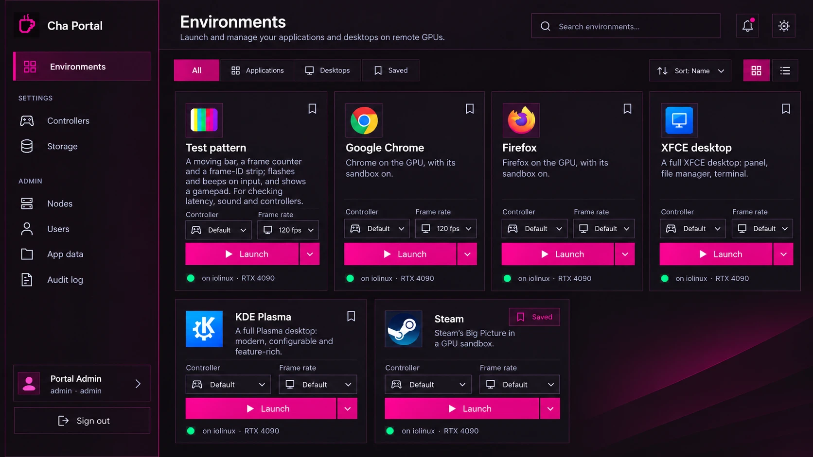

# Themes, and a UI pass to go with them

Status: T1–T4 done; T5 (sweep and verification) next.

Goal: the portal gets themes that are easy to adjust and accessible by construction. **Cha – Magenta** (the dark magenta mock below) becomes the first theme and the default. The same pass moves the shell and the Environments page to the mock's layout and makes both work cleanly from a phone up to a 1440p display.



## Where we are

The groundwork is better than usual:

- Components already use **semantic tokens** (`canvas`, `panel`, `panel-2`, `line`, `ink`, `ink-2`, `ink-3`, `accent`, `accent-ink`, `danger`, `warn`), defined once in `web/apps/portal/src/style.css` `@theme`. There are about 400 token uses across about 3,600 lines of Vue.
- Only six raw colours slip past the tokens: `text-sky-300`, `text-violet-300` and `text-pink-300` in `StatsOverlay.vue`, `bg-black/50` and `bg-black/60` for scrims (`AppShell`, `ConfirmDialog`, `RecordingDialog`), and `bg-black` behind the stream (`SessionView`, where it is correct).
- `BrandMark.vue` hard-codes jade hex values.

Gaps:

| Gap | Why it matters |
|---|---|
| Tokens are compile-time `@theme` values | They can't change at runtime, so there is one theme and no light mode. |
| `ink-3` (#6b8087 on #10181b) is **4.33:1** | Fails WCAG AA (4.5:1) and is used 67 times for real text: timestamps, captions, labels. |
| Field and select borders use `line` (~1.3:1) | Fails WCAG 1.4.11: control boundaries need 3:1. |
| `btn-primary` hovers with `brightness-110` | Brightening a fill under white text lowers contrast; magenta would drop below AA. |
| `accent` stands for both "brand" and "running/OK" | A magenta theme would turn "running" pink. The mock uses green for that. |
| Font sizes in px (`text-[10px]`, `[11px]`, `[15px]`) | They don't follow the browser text size (the web version of Dynamic Type). |
| Card selects are `py-1 text-xs` (~26 px tall) | Under Apple's 44×44 pt minimum on touch. |
| `<meta name="color-scheme" content="dark">` only; the mobile menu is a `☰` glyph with no focus handling | No light scheme. The drawer doesn't trap focus, close on Esc or make the page behind it inert. |

## Mock contrast check

The mock's hot pink (about `#ff1493`) under white text measures **3.64:1, which fails AA**. The fix keeps the look: a slightly deeper fill for buttons and a brighter magenta for text and icons on dark surfaces. Every pair below passes WCAG 2.2 AA. Measured values:

**Cha – Magenta, dark**

| Token | Value | Key pairs |
|---|---|---|
| canvas / panel / panel-2 | `#12060f` / `#1c0b18` / `#2a1024` | |
| ink | `#fbeef6` | 16.8:1 on panel |
| ink-2 | `#d4b8ca` | 10.4:1 on panel |
| ink-3 | `#a88a9d` | 6.1:1 on panel, 5.7:1 on panel-2 |
| accent (text, icons, active nav) | `#ff4fb3` | 6.3:1 on panel |
| accent-fill / hover | `#d6087f` / `#bd0070` | white on it: 5.0:1 / 6.2:1 |
| on-accent | `#ffffff` | |
| line (decorative card borders) | `#3a1a32` | exempt; decoration only |
| line-strong (fields, selects, toggles) | `#8a5a7d` | 3.2–3.6:1 |
| focus | `#ff8acb` | 8.1:1 or better |
| ok / warn / danger | `#34d399` / `#fbbf24` / `#ff7a8f` | 9.8 / 11.3 / 7.6:1 on panel |

**Cha – Magenta, light** (the mock is dark only; Apple's guidelines expect both)

| Token | Value | Key pairs |
|---|---|---|
| canvas / panel / panel-2 | `#fbf5f9` / `#ffffff` / `#f6ebf2` | |
| ink / ink-2 / ink-3 | `#22091b` / `#5c3d52` / `#7a5c70` | 18.7 / 9.4 / 5.9:1 on panel |
| accent / accent-fill / hover | `#b8006b` / `#c2006f` / `#a3005d` | accent 6.5:1; white on fill 6.0:1 |
| line / line-strong | `#ecd9e5` / `#9a6f8c` | line-strong 3.6:1 or better |
| ok / warn / danger | `#047857` / `#92400e` / `#c0182f` | 4.7:1 or better on every surface |

These are starting values. The contrast test (below) decides; we don't judge contrast by eye.

## Token architecture

Three tiers. Components only ever see the middle one.

1. **Primitives**: per-theme ramps written in **OKLCH** (`--cha-magenta-500: oklch(…)`). OKLCH keeps lightness steps even across hues, so a new theme is mostly a hue change. Primitives never reach components.
2. **Semantic roles**: the contract every theme must fill. We keep today's names so the ~400 existing uses don't churn, and add the missing roles:

   | Role | New? | Use |
   |---|---|---|
   | `canvas`, `panel`, `panel-2` | | Base, raised and more-raised surfaces. In dark mode, raised surfaces get lighter instead of using shadows, as in Apple's dark mode. |
   | `ink`, `ink-2`, `ink-3` | | Primary, secondary and tertiary text. **All three must be ≥4.5:1**, because `ink-3` carries real information. |
   | `line` | | Decorative separators and card edges. |
   | `line-strong` | new | Edges that identify a control (fields, selects, switches, ghost buttons). ≥3:1. |
   | `accent` | | Brand colour as text or icon on a surface. ≥4.5:1. |
   | `accent-fill`, `accent-fill-hover`, `on-accent` | new (`accent-ink` → `on-accent`) | Primary buttons and selected segments. Hover gets darker in both appearances, so contrast only goes up. |
   | `accent-soft` | new | Tinted background for the selected nav item, the selected filter and the "Saved" chip. |
   | `focus` | new | The focus ring. ≥3:1 against every surface. |
   | `ok`, `warn`, `danger`, `info` | `ok`, `info` new | Status. "Running" moves from `accent` to `ok`. |
   | `scrim` | new | Behind dialogs and the mobile drawer. Replaces `bg-black/50` and `/60`. |
   | `chart-1…4` | new | StatsOverlay section headings and graphs. Replaces sky, violet and pink. |

3. **Component tokens**, only where a component really needs its own knob: `--radius-card`, `--radius-control`, `--shadow-glow` (the faint magenta lift in the mock), `--sidebar-material`.

### How it's wired (Tailwind 4)

```css
/* style.css: utilities point at runtime variables */
@theme inline {
  --color-canvas: var(--cha-canvas);
  --color-accent-fill: var(--cha-accent-fill);
  /* … every role … */
}
```

```css
/* themes/cha-magenta.css: one file per theme */
:root[data-theme="cha-magenta"] { color-scheme: dark; --cha-canvas: #12060f; /* … */ }
:root[data-theme="cha-magenta"][data-appearance="light"] { color-scheme: light; --cha-canvas: #fbf5f9; /* … */ }
:root[data-theme="cha-magenta"][data-contrast="more"] { --cha-ink-3: …; --cha-line: …; /* AAA overrides */ }
```

`@theme inline` makes `bg-canvas` compile to `var(--cha-canvas)`, so changing theme means changing an attribute on `<html>`. Nothing rebuilds and the markup doesn't change. Alpha modifiers such as `bg-panel/90` keep working through `color-mix()`.

A small registry (`src/themes/index.ts`) lists each theme's id, display name, the appearances it supports and preview swatches for the picker. Adding a theme means one CSS file plus one registry entry, and it has to pass the test.

## How adjustable

Each setting has a **System** choice that follows the OS. That is the default wherever the OS has an opinion:

| Setting | Choices | Driven by |
|---|---|---|
| Theme | Cha – Magenta (default), Cha – Jade (today's look, kept, with its contrast fixed) | user |
| Appearance | System / Dark / Light | `prefers-color-scheme` |
| Contrast | System / Standard / More | `prefers-contrast: more` (macOS and iOS "Increase Contrast"). More means body text ≥7:1 (AAA), stronger lines and no tinted-only states. |
| Motion | System / Reduced | `prefers-reduced-motion`. Transitions become fades or nothing; the indeterminate bar becomes a static stripe. |
| Transparency | System / Reduced | `prefers-reduced-transparency`. The sidebar's blur becomes a solid `panel`. |
| Text size | follows the browser | All type in `rem`, so browser zoom and text size work up to 200% without the layout breaking. |

**Later:** a custom accent hue. The user picks a hue and we derive the fill, text and focus colours in OKLCH, raising or lowering lightness until every contract pair passes. The check would run in the browser with the same function the test uses. Not in the first pass.

### Persistence and no flash

- An inline script in `index.html` (a few lines, before CSS) reads the cached choice from `localStorage` and sets `data-theme`, `data-appearance` and `data-contrast` on `<html>` before first paint. The first frame is never the wrong colour.
- The choice is also stored per user on the server (`migrations/0010_user_prefs.sql`: one `user_prefs` row with a small JSON document, `GET`/`PUT /api/me/prefs`), so it follows the user to another device. On sign-in the server copy wins and refreshes the cache.
- `<meta name="color-scheme" content="dark light">`, plus a `theme-color` meta per appearance so Safari's and iOS's chrome matches.

## Contrast is enforced by a test, not by review

`web/apps/portal/src/themes/themes.test.ts` (bun test):

1. Parses every theme CSS file. For each variant (dark, light, and each with contrast "more") it resolves the role values, converting hex and OKLCH to sRGB.
2. **Completeness:** every role in the contract is defined in every variant. A theme missing `focus` fails.
3. **Pair matrix** (WCAG 2.2 relative luminance):
   - `ink`, `ink-2`, `ink-3`, `accent`, `ok`, `warn`, `danger`, `info` on `canvas`, `panel` and `panel-2`: ≥4.5:1 (≥7:1 for `ink` and `ink-2` under contrast "more").
   - `on-accent` on `accent-fill` and on `accent-fill-hover`: ≥4.5:1.
   - `line-strong` and `focus` against each surface: ≥3:1.
   - Status dots (`ok`, `warn`, `danger`) against their surface: ≥3:1.
4. A failure names the theme, the variant, the pair, the ratio and the target.

It runs in `./scripts/check.sh` with the other portal checks. APCA scores go in the output for information only; WCAG 2.2 AA is the gate.

Rules for components, listed in the plan and enforced where we can:

- No raw palette classes (`bg-pink-500`, `text-white`) and no hex in `.vue` files. A `grep` step in `check.sh` fails on them, with an allow-list for the stream's `bg-black`.
- Never colour alone: state always comes with a shape, label or icon. Examples: the dot plus "Running"; the selected nav item gets a bar plus weight, not only a tint; "Saved" is an icon plus a word plus `aria-pressed`.
- Focus is always visible (`:focus-visible` ring in `focus`, 2 px, offset 2 px) and never removed without a replacement.

## Apple HIG, applied

What we take from Apple's Human Interface Guidelines, translated for a web app in Chrome and Safari on a Mac first:

- **Defer to content.** The stream view stays pure black and theme-neutral. The theme never tints video. Overlays (the stats panel, the pointer-lock hint) use `scrim` and stay legible over any frame.
- **Hierarchy through type, not boxes.** A type scale modelled on Apple's text styles, in rem: Large Title (page title, 1.75rem/600), Title 3 (card title, 1.25rem/600), Headline, Body (1rem), Callout, Subheadline (0.875rem; field labels), Footnote and Caption 1 (0.75rem), Caption 2 (0.6875rem, the floor; only for dense readouts such as the stats overlay). Nothing smaller, so the 10 px size goes. The font stack puts `system-ui`/`-apple-system` first, which gives SF Pro on Apple devices, with Inter as the fallback elsewhere.
- **Sidebar navigation** as in the mock: an icon plus label per item, section headers ("Settings", "Admin"), the selected item with an accent bar and `accent-soft` fill, and the account card at the bottom. **We can't use SF Symbols:** their licence limits them to Apple platforms. We use Lucide (ISC licence, compatible with AGPL), one stroke weight throughout, with decorative icons `aria-hidden`.
- **Materials.** The sidebar and the sticky header get a subtle translucent material (`backdrop-filter`), dropped under reduced transparency and when the browser lacks support.
- **Hit targets** of at least 44×44 pt where `pointer: coarse` (selects, the Launch chevron, bookmark, nav items). On a Mac with a fine pointer, controls can stay compact (≥28 px) as in the mock.
- **Concentric corners.** Inner radius = outer radius − padding (card 14 px, control 8 px), so nested shapes line up.
- **Motion with purpose.** 150–250 ms ease-out for state changes and a slide for the drawer; nothing decorative loops. Everything respects reduced motion.
- **Light and dark** are equal citizens, and the system setting is the default.
- **Plain language** stays as it is (the portal's copy is already good). Placeholder text never replaces a label.

## Responsive layout

Content-out, not device-out:

| Width | Shell | Environments grid |
|---|---|---|
| < 768 px | The sidebar becomes a drawer: a real menu button (icon, `aria-expanded`), focus trapped inside, Esc closes it, the page behind becomes `inert`, and `scrim` covers it. The header keeps the title; search collapses to an icon that expands. | 1 column; filter chips scroll horizontally |
| 768–1279 px | Fixed sidebar, 240 px (narrows to icons only below 1024 px, with tooltips and accessible names) | 2–3 columns |
| ≥ 1280 px | Full sidebar, 256 px | 3–4 columns; `max-w` around 1600 px so lines don't run long on ultrawide screens |

Cards use **container queries** (`@container`), so a card lays itself out by its own width: icon beside the title when it's wide, stacked when it's narrow (the mock's KDE/Steam cards against the top row). The grid is `repeat(auto-fill, minmax(17rem, 1fr))`, not fixed breakpoints. Safe-area insets are respected for iPad and iPhone.

## Environments page, per the mock

Theming carries most of this. A few pieces are new behaviour, so each is its own step:

- **Header:** page title plus a one-line description, search ("Search environments…", filters the catalog on the client), and a quick appearance toggle (the sun icon). The full settings live on the Appearance page.
- **Filter bar:** a segmented control (All / Applications / Desktops / Saved) built as a `radiogroup` with arrow-key navigation, plus Sort (Name / Recently used) and Grid/List view. View and sort are remembered per user.
- **Cards:** the app icon (see below), title, description clamped to 3 lines with the rest in `title`, then Controller and Frame rate selects, the split **Launch** button (the existing `LaunchButton` placement chooser, restyled), and a footer naming the node and GPU from placements data ("on gpu-node · RTX 4090") with an `ok` dot.
- **App icons:** an optional `icon` field in `images/catalog.json` pointing to an SVG beside each image. The fallback is today's class glyph on an `accent-soft` tile. The browser and Steam logos are trademarks: we show them only to identify the app, unmodified, and record their sources in `images/README.md`.
- **The bookmark versus "Saved":** ⚠️ the mock's bookmark and "Saved" filter read as *favourites*. Today, "Saved" on a card means *the app keeps your data between launches*. Shipping both under one word would confuse people. Proposal: the bookmark becomes **Pin** (favourite; pinned cards sort first; the filter is called "Pinned"), and data persistence keeps its own small database-icon badge, as now. Needs the owner's call (below).
- **Notifications bell:** out of scope. The portal has no notification source yet. Leave it out instead of shipping a dead control.

## Phases

Each phase ships on its own and passes `./scripts/check.sh`.

**T1 – Token foundation** (no intended visual change except the contrast fixes)
1. `@theme inline` → `--cha-*` runtime variables; today's palette moves to `themes/cha-jade.css`.
2. Add the new roles (`line-strong`, `accent-fill*`, `on-accent`, `accent-soft`, `focus`, `ok`, `info`, `scrim`, `chart-*`). Point fields, selects and ghost buttons at `line-strong`. "Running" uses `ok`. `btn-primary` hover goes darker.
3. Replace the six raw colours. `BrandMark` uses `currentColor` and tokens.
4. Type scale in rem; remove the px sizes.
5. `themes.test.ts` plus the raw-colour `grep` in `check.sh`. Fix Jade's `ink-3` (4.33 → ≥4.5).

**T2 – Cha – Magenta**
1. `themes/cha-magenta.css`: dark, light, and contrast "more" for each. Primitives in OKLCH.
2. Make it the default. Brand mark and favicon get a magenta variant, picked per theme.
3. The pre-paint script, `color-scheme` and `theme-color`.

**T3 – Appearance settings**
1. Settings → **Appearance**: theme cards with live swatches, plus segmented controls for Appearance, Contrast, Motion and Transparency, each with a System choice. Changes apply as you pick them.
2. `0010_user_prefs` migration, `GET`/`PUT /api/me/prefs` through `api.ts`, and API tests in `crates/cha-control/tests/api.rs`.
3. The header's quick appearance toggle.

**T4 – Shell and Environments layout**
1. Sidebar with icons (Lucide), selected-state bar, account card; the accessible drawer below 768 px; icon-only rail at 768–1023 px.
2. Environments header, search, filter, sort and view; cards with container queries and the node/GPU footer.
3. `icon` in the catalog, and Pin (if approved).

**T5 – Sweep and verification**
1. Every other view (Controllers, Storage, Nodes, Users, App data, Audit, Login, Setup, dialogs, StatsOverlay) checked against the token rules and touch targets.
2. Screenshots at 375, 768, 1280 and 1440 px in dark, light and contrast "more", from **real Chrome** on the M4 (the in-app browser pane isn't a faithful reference), plus Safari.
3. A keyboard-only pass over every flow, and a VoiceOver pass over the shell, Environments and Appearance.
4. Docs: an ADR "Theme token contract" (the roles, the tiers, the contrast gate); this file's status; the portal README section on themes and how to add one.

## Decisions (owner, 2026-10-06)

1. **Cha – Jade stays** as a second theme (today's look, contrast fixed).
2. **The bookmark is Pin** (favourites, a "Pinned" filter); data persistence keeps its own badge.
3. **Icons come from `lucide-vue-next`** (ISC), tree-shaken.
4. **Preferences are stored on the server** (migration 0010) as well as cached locally.
